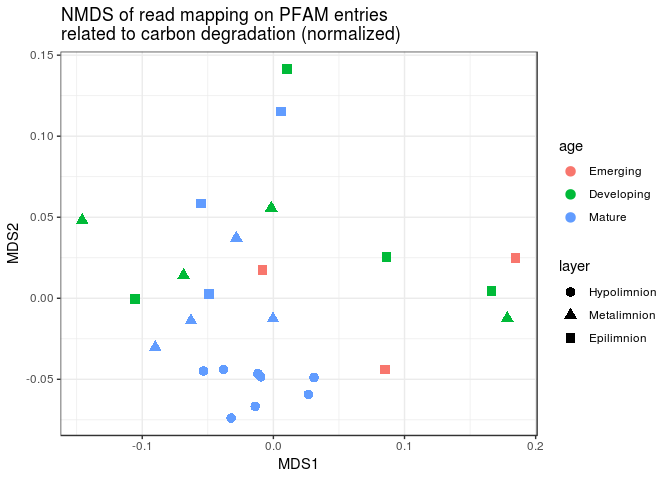
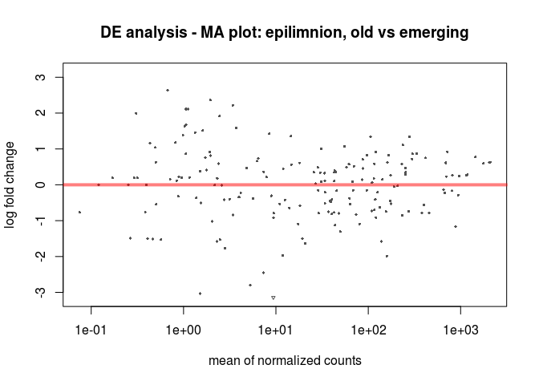
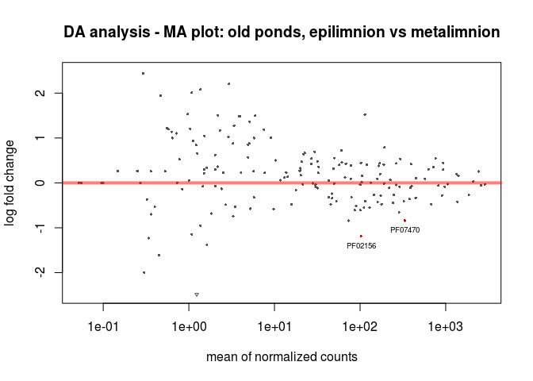
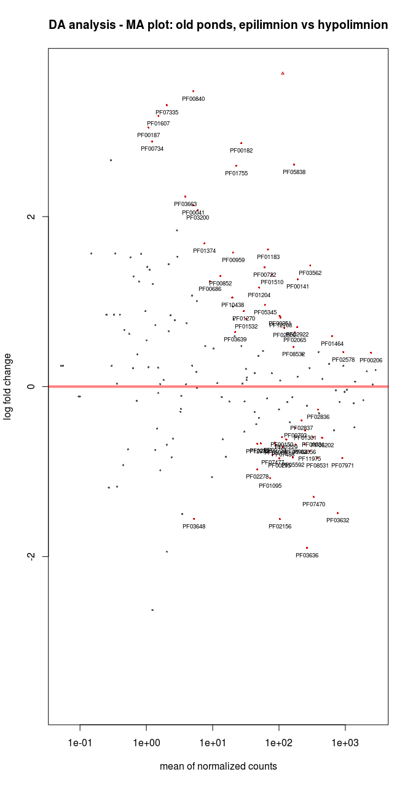
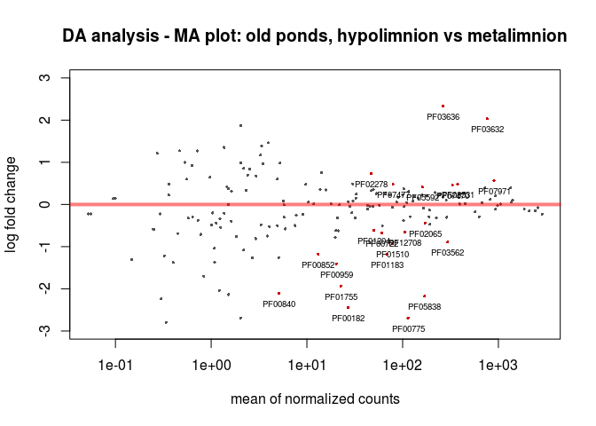
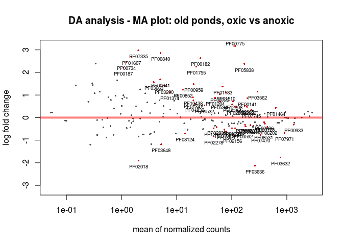

## Summary

Differential abundance analysis of genes involved in carbon degradation in samples from thaw ponds, according to:

- Ages in epilimnion samples
- Layers in old ponds
- Oxygen content in old ponds.

The analyses were performed with two different strategies:

- Quantifying reads directly mapping on PFAM entries of interest;
- Quantifying reads mapping on genes annotated on contigs from a coassembly of all read datasets.

## Methods in brief

Raw reads were trimmed with **sickle**v1.210 (default parameters) and mapped on Pfam HMMs of interest with **metadomain**. Read datasets were splitted in subsets of 500K reads for this analysis and the results combined in this protocol. 
Contigs co-assembled from all read datasets were annotated against PFAM using **hmmer**. Read datasets were mapped against the contigs with **bowtie2**. Reads mapping on annotated PFAM entries were counted with **htseq-count**. 
Two separate data exploration and DA analysis were performed, by using read mappings on PFAM entries of interest and read mappings on contigs assembled from metagenomic datasets.
Data exploration was performed with the **metaMDS** function available through the R **vegan** package, to perform NMDS to compare the distribution of PFAM entries of interest in the analysed samples. Differential abundance (DA) analysis was performed with R package **DESeq2**. DA analyses were carried out by performing pairwise comparisons of tested multiple conditions, namely *old*, *emerge*, *medium* within epilimnion samples, and *epilimnion*, *metalimnion* and *hypolimnion* within old samples. An additional DA analysis was performed considering altogether *epilimnion* and *metalimnion* as *oxic* samples, compared to *hypolimnion* samples which were considered as *anoxic* samples. For each DA analysis, two outputs are shown: 1) MA-plot (described in the next section) and 2) a searchable/filterable table with DA results reported for each PFAM entry. Each table is also exported as csv file.

### Note on MA plots

The MA-plot shows the log2 fold changes over the mean of normalized counts, i.e. the average of counts normalized by size factor. The x axis is the average abundance over all samples, the y axis the log2 fold change between the first condition and the second condition *eg* if an MA-plot shows epilimnion vs metalimnion, PFAM entries with a positive log2 fold change are more abundant in epilimnion samples, when compared to metalimnion samples. For each PFAM entry an adjusted p-value is calculated by the DA pipeline. PFAM entries with an adjusted p-value below a threshold (here 0.1, the suggested default) are shown in red. For each MA-plot, the related data table is reported in a searchable/filterable format, where the aforementioned adjusted p-value is reported in the last column. This table might turn useful for DA analyses returning several differentially abundant PFAM entries.

### Functions used in this report (click "Code" on the right to expand)


```r
# code to read all metadomain results
getBigTable <- function(i){
  small.table <- read.table(i, header = FALSE, stringsAsFactors = FALSE)
  colnames(small.table) <- c("PFAM_ID", "PFAM_length", "n_reads", "PFAM_cov", "PFAM_status")
  # i is eg ../metadomain_1M/A-1_S21_L005.0.1.fasta.metadomain
  sample_name <- strsplit(basename(i), "_")[[1]][1]
  p <- data.frame(sample=c(sample_name), stringsAsFactors = FALSE)
  small.table <- cbind(p, small.table)
}

getBigTable.general <- function(i, ColNames=NULL){
  small.table <- read.table(i, header = FALSE, stringsAsFactors = FALSE)
  colnames(small.table) <- ColNames
  sample_name <- strsplit(basename(i), "_")[[1]][1]
  p <- data.frame(sample=c(sample_name), stringsAsFactors = FALSE)
  small.table <- cbind(p, small.table)
}

# Calculate TPM for each PFAM in each sample
#calculate.RPK <- function(table.counts, sample, n_reads, feature.length){
calculate.RPK <- function(table.counts, sample, feature.name, pfam.data){
  RPK <- table.counts %>%
            base::subset(sample == sample)
  return(RPK)
}

# this is for read counts from mapping on contigs which were annotated against PFAM
getBigTable.tpm.pfam <- function(i, pfam.lengths.nt){
  small.table <- read.table(i, header = FALSE, stringsAsFactors = FALSE, col.names = c("PFAM_ID", "n_reads")) %>%
    filter(!base::grepl("^_", PFAM_ID)) %>%
    mutate_at("PFAM_ID", str_trunc, width=7, ellipsis="") %>%
#strsplit(pfam.lengths$PFAM_ID, split = "\\.") %>% unlist %>% matrix(ncol = 2, byrow = TRUE) %>% as.data.frame %>% .$V1
    left_join(pfam.lengths, by = c("PFAM_ID" = "PFAM_ID.noversion")) %>%
    select(-c(PFAM_ID.y, PFAM_length)) %>%
    mutate(tpm=n_reads/PFAM_length_nt/sum(n_reads/PFAM_length_nt)*1e06)
    #big.table.pfam[base::grep("^_", big.table.pfam$PFAM_ID, invert=TRUE),]
  #colnames(small.table) <- c("PFAM_ID", "n_reads")
  # i is eg ../metadomain_1M/A-1_S21_L005.0.1.fasta.metadomain
  sample_name <- strsplit(basename(i), "_")[[1]][1]
  p <- data.frame(sample=c(sample_name), stringsAsFactors = FALSE)
  small.table <- cbind(p, small.table)
}

plotMA.significant <- function(df, t=0.1, cex=0.8, main="DE analysis - MA plot"){
  plotMA(df, main=main)
  xx <- df$baseMean
  yy <- df$log2FoldChange
  # Replace NAs in padj with values that you'll never want to consider :-)
  signSubset <- replace(df$padj, is.na(df$padj), 1000) < t
  if(count(signSubset, TRUE) > 0)
    text( xx[signSubset],
          yy[signSubset],
          labels=rownames(df)[signSubset],
          pos=1, cex=cex)
    text( xx[c(TRUE)],
          yy[c(TRUE)],
          labels=c(""))
}
# # pointLabel(x, y, as.character(round(x,5)), offset = 0, cex = .7)
# 
# plotMA.significant.pointlabel <- function(df, t=0.1, cex=0.8, main="DE analysis - MA plot"){
#   plotMA(df, main=main)
#   xx <- df$baseMean
#   yy <- df$log2FoldChange
#   # Replace NAs in padj with values that you'll never want to consider :-)
#   signSubset <- replace(df$padj, is.na(df$padj), 1000) < t
#   if(count(signSubset, TRUE) > 0)
#     pointLabel(xx[signSubset],
#                yy[signSubset],
#                labels=rownames(df)[signSubset],
#                pos=1, cex=cex)
#     # text( xx[signSubset],
#     #       yy[signSubset],
#     #       labels=rownames(df)[signSubset],
#     #       pos=1, cex=cex)
#     text( xx[c(TRUE)],
#           yy[c(TRUE)],
#           labels=c(""))
# }
# 
# plotMA.significant.thigmo <- function(df, t=0.1, cex=0.8, main="DE analysis - MA plot"){
#   plotMA(df, main=main)
#   xx <- df$baseMean
#   yy <- df$log2FoldChange
#   # Replace NAs in padj with values that you'll never want to consider :-)
#   signSubset <- replace(df$padj, is.na(df$padj), 1000) < t
#   if(count(signSubset, TRUE) > 0)
#     thigmophobe.labels(xx[signSubset],
#                yy[signSubset],
#                labels=rownames(df)[signSubset],
#                cex=cex)
#     # pointLabel(xx[signSubset],
#     #            yy[signSubset],
#     #            labels=rownames(df)[signSubset],
#     #            pos=1, cex=cex)
#     # text( xx[signSubset],
#     #       yy[signSubset],
#     #       labels=rownames(df)[signSubset],
#     #       pos=1, cex=cex)
#     text( xx[c(TRUE)],
#           yy[c(TRUE)],
#           labels=c(""))
# }

# since the DESeq2 table has PFAM ids as rownames,
# we need to extract the PFAM ids and add them to the dataframe
# as the first column
DESeq2datatable <- function(DESeq2.data){
  DESeq2.data <- DESeq2.data[which(DESeq2.data$padj < 0.1),]
  datatable(data.frame(cbind(data.frame(PFAM_ID=row.names(DESeq2.data)), DESeq2.data)), rownames = FALSE, filter = "top")
}

# function to write out table DESeq2 table in csv format
DESeq2csv <- function(DESeq2.data, file="DESeq2_data.csv"){
  DESeq2.data <- DESeq2.data[which(DESeq2.data$padj < 0.1),]
  write.table(data.frame(cbind(data.frame(PFAM_ID=row.names(DESeq2.data)), DESeq2.data)), row.names = FALSE, file=file, sep = ",")
}
```

## Mapping of reads on HMM profiles

### Data preparation


```r

# Read sample metadata and join it with table with dataset size:

metadata <- read_csv("data/metadata.csv")
## Warning: Missing column names filled in: 'X24' [24]
## Parsed with column specification:
## cols(
##   .default = col_double(),
##   sample_code = col_character(),
##   Pond = col_character(),
##   rawdata = col_character(),
##   size = col_character(),
##   layer = col_character(),
##   X24 = col_logical(),
##   methanotrophs = col_logical(),
##   sample = col_character()
## )
## See spec(...) for full column specifications.
metadata$sample_name <- gsub("_", "-", metadata$sample_code)
colnames(metadata)[(names(metadata) == "size")] <- "age"
rownames(metadata) <- metadata$sample_name
## Warning: Setting row names on a tibble is deprecated.

metadata.dataset_size <- read_csv("data/sample_name_reads")
## Parsed with column specification:
## cols(
##   sample_name = col_character(),
##   total_reads = col_double()
## )

# add dataset sizes
metadata <- metadata %>%
  left_join(metadata.dataset_size)
## Joining, by = "sample_name"

# For each sample, read all result files

all_files = list.files("./metadomain_1M", full.names = TRUE)
big.table <- data.frame(rbindlist(lapply(all_files, function(x) getBigTable(paste(x)))))
big.table$n_reads <- as.integer(big.table$n_reads)
big.table$PFAM_length <- as.integer(big.table$PFAM_length)
big.table$PFAM_cov <- as.numeric(big.table$PFAM_cov)

# Group counts by sample and PFAM_ID, **save it**.
all.final.table <- big.table %>% 
  group_by(sample, PFAM_ID, PFAM_length) %>%
  summarise(sum(n_reads)) %>%
  ungroup()

colnames(all.final.table)[4] <- "read_count"

# Convert count table in matrix
all.final.matrix <- all.final.table %>%
  subset(select = -PFAM_length) %>%
  spread(PFAM_ID, read_count)

rownames.all.final.matrix <- all.final.matrix$sample
all.final.matrix <- data.matrix(subset(all.final.matrix, select = -sample)) 
rownames(all.final.matrix) <- rownames.all.final.matrix
```

### Overview of read mappings on PFAM HMMs of interest


```r
data.frame(sample_name=row.names(all.final.matrix), total_mapped_reads=rowSums(all.final.matrix)) %>%
  left_join(metadata.dataset_size) %>%
  mutate("total_mapped_reads (%)"=total_mapped_reads*100/total_reads) %>%
  datatable(rownames = FALSE, filter = "top", options = list(pageLength = 30))
```

### NMDS on normalized data

Perform NMDS on normalized data. Data are normalized by rarefying to the sample with the lowest number of reads mapped on PFAM HMMs of interest and plotted with ggplot.


```r
# source: http://geoffreyzahn.com/nmds-example/
min_depth = min(rowSums(all.final.matrix))

# normalize data
all.final.matrix.rarefied <- as.matrix(round(rrarefy(all.final.matrix, min_depth)))

# calculate distance matrix
sample_dist.rarefied <- as.matrix((vegdist(all.final.matrix.rarefied, "bray")))

# perform actual NMDS
NMDS.rarefied <- metaMDS(sample_dist.rarefied)
## Run 0 stress 0.09855968 
## Run 1 stress 0.09892352 
## ... Procrustes: rmse 0.009040645  max resid 0.03324108 
## Run 2 stress 0.09953173 
## Run 3 stress 0.09855968 
## ... New best solution
## ... Procrustes: rmse 1.717845e-06  max resid 7.00802e-06 
## ... Similar to previous best
## Run 4 stress 0.09855968 
## ... Procrustes: rmse 8.633061e-06  max resid 2.40131e-05 
## ... Similar to previous best
## Run 5 stress 0.3869794 
## Run 6 stress 0.09953171 
## Run 7 stress 0.09953171 
## Run 8 stress 0.09953171 
## Run 9 stress 0.1752186 
## Run 10 stress 0.2239159 
## Run 11 stress 0.09892352 
## ... Procrustes: rmse 0.009045587  max resid 0.03326319 
## Run 12 stress 0.09892352 
## ... Procrustes: rmse 0.009048231  max resid 0.03326824 
## Run 13 stress 0.09855968 
## ... Procrustes: rmse 6.042349e-06  max resid 1.147871e-05 
## ... Similar to previous best
## Run 14 stress 0.09892352 
## ... Procrustes: rmse 0.009043277  max resid 0.0332536 
## Run 15 stress 0.09892352 
## ... Procrustes: rmse 0.009043698  max resid 0.03325518 
## Run 16 stress 0.175207 
## Run 17 stress 0.09953171 
## Run 18 stress 0.09953171 
## Run 19 stress 0.09855968 
## ... New best solution
## ... Procrustes: rmse 3.468732e-06  max resid 9.142237e-06 
## ... Similar to previous best
## Run 20 stress 0.09855968 
## ... Procrustes: rmse 1.628341e-05  max resid 3.808266e-05 
## ... Similar to previous best
## *** Solution reached

# build a data frame with NMDS coordinates and metadata
#MDS1 = NMDS$points[,1]
#MDS2 = NMDS$points[,2]
NMDS.rarefied.df = data.frame(MDS1 = NMDS.rarefied$points[,1],
                              MDS2 = NMDS.rarefied$points[,2])
NMDS.rarefied.df$sample_name <- rownames(NMDS.rarefied.df)
NMDS.rarefied.df <- NMDS.rarefied.df %>%
  left_join(metadata)
## Joining, by = "sample_name"

# Plot with ggplot
ggplot(NMDS.rarefied.df, aes(x=MDS1, y=MDS2, col=age, shape=layer)) +
 geom_point() +
 geom_text(aes(label=sample_name),hjust=-0.15,vjust=0, size=3) +
 #stat_ellipse() +
 theme_bw() +
 labs(title = "NMDS of read mapping on PFAM entries\nrelated to carbon degradation (normalized)")
```

<!-- -->

### Differential abundance analysis between ages in epilimnion samples

Generate input data for DESeq2, then create a CountDataSet object.


```r
# count table
de.epi.age.matrix <- metadata %>%
  subset(layer == "epilimnion") %>%
  inner_join(all.final.table, by = c("sample_name" = "sample")) %>%
  subset(select = c(sample_name, PFAM_ID, read_count)) %>%
  spread(PFAM_ID, read_count)

colnames.de.epi.age.matrix <- de.epi.age.matrix$sample_name
de.epi.age.matrix <- subset(de.epi.age.matrix, select = -sample_name) %>% t()
colnames(de.epi.age.matrix) <- colnames.de.epi.age.matrix

# metadata
de.epi.age.design <- metadata %>%
  subset(layer == "epilimnion") %>%
  inner_join(all.final.table, by = c("sample_name" = "sample")) %>%
  subset(select = c(sample_name, age)) %>%
  distinct()

de.epi.age.design <- de.epi.age.design[base::order(de.epi.age.design$sample_name),]

rownames.de.epi.age.design <- de.epi.age.design$sample_name
de.epi.age.design <- subset(de.epi.age.design, select = -sample_name)
rownames(de.epi.age.design) <- rownames.de.epi.age.design
## Warning: Setting row names on a tibble is deprecated.

# data need to be factor
de.epi.age.design$age <- factor(de.epi.age.design$age)

# Then create a CountDataSet object
ddsFullCountTable <- DESeqDataSetFromMatrix(
countData = de.epi.age.matrix,
colData = de.epi.age.design,
design = ~ age)
```

Run the DESeq2 pipeline and extract results for pairwise comparisons between ages


```r
dds <- DESeq(ddsFullCountTable)
## estimating size factors
## estimating dispersions
## gene-wise dispersion estimates
## mean-dispersion relationship
## final dispersion estimates
## fitting model and testing
res <- results(dds)
res.old_emerge    <- results(dds, contrast = c("age", "old", "emerge"))
res.old_medium    <- results(dds, contrast = c("age", "old", "medium"))
res.emerge_medium <- results(dds, contrast = c("age", "emerge", "medium"))
```

#### Old vs emerging


```r
plotMA.significant(res.old_emerge, cex = 0.6, main="DE analysis - MA plot: epilimnion, old vs emerging")
```

<!-- -->

```r
DESeq2datatable(res.old_emerge)
```

<!--html_preserve--><div id="htmlwidget-75f328ddf262ff4219b9" style="width:100%;height:auto;" class="datatables html-widget"></div>
<script type="application/json" data-for="htmlwidget-75f328ddf262ff4219b9">{"x":{"filter":"top","filterHTML":"<tr>\n  <td data-type=\"disabled\" style=\"vertical-align: top;\">\n    <div class=\"form-group has-feedback\" style=\"margin-bottom: auto;\">\n      <input type=\"search\" placeholder=\"All\" class=\"form-control\" style=\"width: 100%;\"/>\n      <span class=\"glyphicon glyphicon-remove-circle form-control-feedback\"><\/span>\n    <\/div>\n  <\/td>\n  <td data-type=\"disabled\" style=\"vertical-align: top;\">\n    <div class=\"form-group has-feedback\" style=\"margin-bottom: auto;\">\n      <input type=\"search\" placeholder=\"All\" class=\"form-control\" style=\"width: 100%;\"/>\n      <span class=\"glyphicon glyphicon-remove-circle form-control-feedback\"><\/span>\n    <\/div>\n  <\/td>\n  <td data-type=\"disabled\" style=\"vertical-align: top;\">\n    <div class=\"form-group has-feedback\" style=\"margin-bottom: auto;\">\n      <input type=\"search\" placeholder=\"All\" class=\"form-control\" style=\"width: 100%;\"/>\n      <span class=\"glyphicon glyphicon-remove-circle form-control-feedback\"><\/span>\n    <\/div>\n  <\/td>\n  <td data-type=\"disabled\" style=\"vertical-align: top;\">\n    <div class=\"form-group has-feedback\" style=\"margin-bottom: auto;\">\n      <input type=\"search\" placeholder=\"All\" class=\"form-control\" style=\"width: 100%;\"/>\n      <span class=\"glyphicon glyphicon-remove-circle form-control-feedback\"><\/span>\n    <\/div>\n  <\/td>\n  <td data-type=\"disabled\" style=\"vertical-align: top;\">\n    <div class=\"form-group has-feedback\" style=\"margin-bottom: auto;\">\n      <input type=\"search\" placeholder=\"All\" class=\"form-control\" style=\"width: 100%;\"/>\n      <span class=\"glyphicon glyphicon-remove-circle form-control-feedback\"><\/span>\n    <\/div>\n  <\/td>\n  <td data-type=\"disabled\" style=\"vertical-align: top;\">\n    <div class=\"form-group has-feedback\" style=\"margin-bottom: auto;\">\n      <input type=\"search\" placeholder=\"All\" class=\"form-control\" style=\"width: 100%;\"/>\n      <span class=\"glyphicon glyphicon-remove-circle form-control-feedback\"><\/span>\n    <\/div>\n  <\/td>\n  <td data-type=\"disabled\" style=\"vertical-align: top;\">\n    <div class=\"form-group has-feedback\" style=\"margin-bottom: auto;\">\n      <input type=\"search\" placeholder=\"All\" class=\"form-control\" style=\"width: 100%;\"/>\n      <span class=\"glyphicon glyphicon-remove-circle form-control-feedback\"><\/span>\n    <\/div>\n  <\/td>\n<\/tr>","data":[[],[],[],[],[],[],[]],"container":"<table class=\"display\">\n  <thead>\n    <tr>\n      <th>PFAM_ID<\/th>\n      <th>baseMean<\/th>\n      <th>log2FoldChange<\/th>\n      <th>lfcSE<\/th>\n      <th>stat<\/th>\n      <th>pvalue<\/th>\n      <th>padj<\/th>\n    <\/tr>\n  <\/thead>\n<\/table>","options":{"columnDefs":[{"className":"dt-right","targets":[1,2,3,4,5,6]}],"order":[],"autoWidth":false,"orderClasses":false,"orderCellsTop":true}},"evals":[],"jsHooks":[]}</script><!--/html_preserve-->

```r
DESeq2csv(res.old_emerge, file="DESeq2.epi.old_vs_emerging.csv")
```

#### Old vs medium


```r
plotMA.significant(res.old_medium, cex = 0.6, main="DE analysis - MA plot: epilimnion, old vs medium")
```

<!-- -->

```r
DESeq2datatable(res.old_medium)
```

<!--html_preserve--><div id="htmlwidget-87ccbfe7d7ca972cfd70" style="width:100%;height:auto;" class="datatables html-widget"></div>
<script type="application/json" data-for="htmlwidget-87ccbfe7d7ca972cfd70">{"x":{"filter":"top","filterHTML":"<tr>\n  <td data-type=\"character\" style=\"vertical-align: top;\">\n    <div class=\"form-group has-feedback\" style=\"margin-bottom: auto;\">\n      <input type=\"search\" placeholder=\"All\" class=\"form-control\" style=\"width: 100%;\"/>\n      <span class=\"glyphicon glyphicon-remove-circle form-control-feedback\"><\/span>\n    <\/div>\n  <\/td>\n  <td data-type=\"number\" style=\"vertical-align: top;\">\n    <div class=\"form-group has-feedback\" style=\"margin-bottom: auto;\">\n      <input type=\"search\" placeholder=\"All\" class=\"form-control\" style=\"width: 100%;\"/>\n      <span class=\"glyphicon glyphicon-remove-circle form-control-feedback\"><\/span>\n    <\/div>\n    <div style=\"display: none; position: absolute; width: 200px;\">\n      <div data-min=\"5.27843280663979\" data-max=\"158.545130777226\" data-scale=\"15\"><\/div>\n      <span style=\"float: left;\"><\/span>\n      <span style=\"float: right;\"><\/span>\n    <\/div>\n  <\/td>\n  <td data-type=\"number\" style=\"vertical-align: top;\">\n    <div class=\"form-group has-feedback\" style=\"margin-bottom: auto;\">\n      <input type=\"search\" placeholder=\"All\" class=\"form-control\" style=\"width: 100%;\"/>\n      <span class=\"glyphicon glyphicon-remove-circle form-control-feedback\"><\/span>\n    <\/div>\n    <div style=\"display: none; position: absolute; width: 200px;\">\n      <div data-min=\"-3.9872555472546\" data-max=\"1.23020475797102\" data-scale=\"15\"><\/div>\n      <span style=\"float: left;\"><\/span>\n      <span style=\"float: right;\"><\/span>\n    <\/div>\n  <\/td>\n  <td data-type=\"number\" style=\"vertical-align: top;\">\n    <div class=\"form-group has-feedback\" style=\"margin-bottom: auto;\">\n      <input type=\"search\" placeholder=\"All\" class=\"form-control\" style=\"width: 100%;\"/>\n      <span class=\"glyphicon glyphicon-remove-circle form-control-feedback\"><\/span>\n    <\/div>\n    <div style=\"display: none; position: absolute; width: 200px;\">\n      <div data-min=\"0.380488894386418\" data-max=\"1.24275018551122\" data-scale=\"15\"><\/div>\n      <span style=\"float: left;\"><\/span>\n      <span style=\"float: right;\"><\/span>\n    <\/div>\n  <\/td>\n  <td data-type=\"number\" style=\"vertical-align: top;\">\n    <div class=\"form-group has-feedback\" style=\"margin-bottom: auto;\">\n      <input type=\"search\" placeholder=\"All\" class=\"form-control\" style=\"width: 100%;\"/>\n      <span class=\"glyphicon glyphicon-remove-circle form-control-feedback\"><\/span>\n    <\/div>\n    <div style=\"display: none; position: absolute; width: 200px;\">\n      <div data-min=\"-3.63464073291097\" data-max=\"3.23322119546975\" data-scale=\"15\"><\/div>\n      <span style=\"float: left;\"><\/span>\n      <span style=\"float: right;\"><\/span>\n    <\/div>\n  <\/td>\n  <td data-type=\"number\" style=\"vertical-align: top;\">\n    <div class=\"form-group has-feedback\" style=\"margin-bottom: auto;\">\n      <input type=\"search\" placeholder=\"All\" class=\"form-control\" style=\"width: 100%;\"/>\n      <span class=\"glyphicon glyphicon-remove-circle form-control-feedback\"><\/span>\n    <\/div>\n    <div style=\"display: none; position: absolute; width: 200px;\">\n      <div data-min=\"0.000278368273169\" data-max=\"0.002748968235542\" data-scale=\"15\"><\/div>\n      <span style=\"float: left;\"><\/span>\n      <span style=\"float: right;\"><\/span>\n    <\/div>\n  <\/td>\n  <td data-type=\"number\" style=\"vertical-align: top;\">\n    <div class=\"form-group has-feedback\" style=\"margin-bottom: auto;\">\n      <input type=\"search\" placeholder=\"All\" class=\"form-control\" style=\"width: 100%;\"/>\n      <span class=\"glyphicon glyphicon-remove-circle form-control-feedback\"><\/span>\n    <\/div>\n    <div style=\"display: none; position: absolute; width: 200px;\">\n      <div data-min=\"0.038806804691952\" data-max=\"0.097863269185285\" data-scale=\"15\"><\/div>\n      <span style=\"float: left;\"><\/span>\n      <span style=\"float: right;\"><\/span>\n    <\/div>\n  <\/td>\n<\/tr>","data":[["PF00722","PF00852","PF02011","PF02435","PF12899"],[55.0465595660164,33.8647952157372,158.545130777226,5.27843280663979,9.38212056465087],[1.23020475797102,-1.87427456671122,-3.9872555472546,-3.78614621489463,-3.1851664422208],[0.380488894386418,0.53287962981086,1.0970150395198,1.24275018551122,1.06367290995091],[3.23322119546975,-3.51725692231185,-3.63464073291097,-3.04658672276692,-2.99449803828114],[0.00122402748079994,0.000436031513392724,0.000278368273169217,0.00231455700635143,0.00274896823554171],[0.0726256305274629,0.0388068046919525,0.0388068046919525,0.0978632691852847,0.0978632691852847]],"container":"<table class=\"display\">\n  <thead>\n    <tr>\n      <th>PFAM_ID<\/th>\n      <th>baseMean<\/th>\n      <th>log2FoldChange<\/th>\n      <th>lfcSE<\/th>\n      <th>stat<\/th>\n      <th>pvalue<\/th>\n      <th>padj<\/th>\n    <\/tr>\n  <\/thead>\n<\/table>","options":{"columnDefs":[{"className":"dt-right","targets":[1,2,3,4,5,6]}],"order":[],"autoWidth":false,"orderClasses":false,"orderCellsTop":true}},"evals":[],"jsHooks":[]}</script><!--/html_preserve-->

```r
DESeq2csv(res.old_medium, file="DESeq2.epi.old_vs_medium.csv")
```

#### Emerging vs medium


```r
plotMA.significant(res.emerge_medium, cex = 0.6, main="DE analysis - MA plot: epilimnion, emerging vs medium")
```

<!-- -->

```r
DESeq2datatable(res.emerge_medium)
```

<!--html_preserve--><div id="htmlwidget-a7d7c18aeb96c426d164" style="width:100%;height:auto;" class="datatables html-widget"></div>
<script type="application/json" data-for="htmlwidget-a7d7c18aeb96c426d164">{"x":{"filter":"top","filterHTML":"<tr>\n  <td data-type=\"disabled\" style=\"vertical-align: top;\">\n    <div class=\"form-group has-feedback\" style=\"margin-bottom: auto;\">\n      <input type=\"search\" placeholder=\"All\" class=\"form-control\" style=\"width: 100%;\"/>\n      <span class=\"glyphicon glyphicon-remove-circle form-control-feedback\"><\/span>\n    <\/div>\n  <\/td>\n  <td data-type=\"number\" style=\"vertical-align: top;\">\n    <div class=\"form-group has-feedback\" style=\"margin-bottom: auto;\">\n      <input type=\"search\" placeholder=\"All\" class=\"form-control\" style=\"width: 100%;\"/>\n      <span class=\"glyphicon glyphicon-remove-circle form-control-feedback\"><\/span>\n    <\/div>\n    <div style=\"display: none; position: absolute; width: 200px;\">\n      <div data-min=\"33.8647952157372\" data-max=\"33.8647952157373\" data-scale=\"13\"><\/div>\n      <span style=\"float: left;\"><\/span>\n      <span style=\"float: right;\"><\/span>\n    <\/div>\n  <\/td>\n  <td data-type=\"number\" style=\"vertical-align: top;\">\n    <div class=\"form-group has-feedback\" style=\"margin-bottom: auto;\">\n      <input type=\"search\" placeholder=\"All\" class=\"form-control\" style=\"width: 100%;\"/>\n      <span class=\"glyphicon glyphicon-remove-circle form-control-feedback\"><\/span>\n    <\/div>\n    <div style=\"display: none; position: absolute; width: 200px;\">\n      <div data-min=\"-1.98099810251752\" data-max=\"-1.98099810251752\" data-scale=\"15\"><\/div>\n      <span style=\"float: left;\"><\/span>\n      <span style=\"float: right;\"><\/span>\n    <\/div>\n  <\/td>\n  <td data-type=\"number\" style=\"vertical-align: top;\">\n    <div class=\"form-group has-feedback\" style=\"margin-bottom: auto;\">\n      <input type=\"search\" placeholder=\"All\" class=\"form-control\" style=\"width: 100%;\"/>\n      <span class=\"glyphicon glyphicon-remove-circle form-control-feedback\"><\/span>\n    <\/div>\n    <div style=\"display: none; position: absolute; width: 200px;\">\n      <div data-min=\"0.531190756826394\" data-max=\"0.531190756826395\" data-scale=\"15\"><\/div>\n      <span style=\"float: left;\"><\/span>\n      <span style=\"float: right;\"><\/span>\n    <\/div>\n  <\/td>\n  <td data-type=\"disabled\" style=\"vertical-align: top;\">\n    <div class=\"form-group has-feedback\" style=\"margin-bottom: auto;\">\n      <input type=\"search\" placeholder=\"All\" class=\"form-control\" style=\"width: 100%;\"/>\n      <span class=\"glyphicon glyphicon-remove-circle form-control-feedback\"><\/span>\n    <\/div>\n  <\/td>\n  <td data-type=\"number\" style=\"vertical-align: top;\">\n    <div class=\"form-group has-feedback\" style=\"margin-bottom: auto;\">\n      <input type=\"search\" placeholder=\"All\" class=\"form-control\" style=\"width: 100%;\"/>\n      <span class=\"glyphicon glyphicon-remove-circle form-control-feedback\"><\/span>\n    <\/div>\n    <div style=\"display: none; position: absolute; width: 200px;\">\n      <div data-min=\"0.000191971687244\" data-max=\"0.000191971687245\" data-scale=\"15\"><\/div>\n      <span style=\"float: left;\"><\/span>\n      <span style=\"float: right;\"><\/span>\n    <\/div>\n  <\/td>\n  <td data-type=\"number\" style=\"vertical-align: top;\">\n    <div class=\"form-group has-feedback\" style=\"margin-bottom: auto;\">\n      <input type=\"search\" placeholder=\"All\" class=\"form-control\" style=\"width: 100%;\"/>\n      <span class=\"glyphicon glyphicon-remove-circle form-control-feedback\"><\/span>\n    <\/div>\n    <div style=\"display: none; position: absolute; width: 200px;\">\n      <div data-min=\"0.034170960329469\" data-max=\"0.03417096032947\" data-scale=\"15\"><\/div>\n      <span style=\"float: left;\"><\/span>\n      <span style=\"float: right;\"><\/span>\n    <\/div>\n  <\/td>\n<\/tr>","data":[["PF00852"],[33.8647952157372],[-1.98099810251752],[0.531190756826395],[-3.72935348941878],[0.000191971687244208],[0.0341709603294691]],"container":"<table class=\"display\">\n  <thead>\n    <tr>\n      <th>PFAM_ID<\/th>\n      <th>baseMean<\/th>\n      <th>log2FoldChange<\/th>\n      <th>lfcSE<\/th>\n      <th>stat<\/th>\n      <th>pvalue<\/th>\n      <th>padj<\/th>\n    <\/tr>\n  <\/thead>\n<\/table>","options":{"columnDefs":[{"className":"dt-right","targets":[1,2,3,4,5,6]}],"order":[],"autoWidth":false,"orderClasses":false,"orderCellsTop":true}},"evals":[],"jsHooks":[]}</script><!--/html_preserve-->

```r
DESeq2csv(res.emerge_medium, file="DESeq2.epi.emerging_vs_medium.csv")
```

### Differential abundance analysis between layers in old ponds

Generate input data for DESeq2.


```r
#### Generate input data for DESeq2:
### count table
de.old.matrix <- metadata %>%
  subset(age == "old") %>%
  inner_join(all.final.table, by = c("sample_name" = "sample")) %>%
  subset(select = c(sample_name, PFAM_ID, read_count)) %>%
  spread(PFAM_ID, read_count)

colnames.de.old.matrix <- de.old.matrix$sample_name
de.old.matrix <- subset(de.old.matrix, select = -sample_name) %>% t()
colnames(de.old.matrix) <- colnames.de.old.matrix

### metadata
de.old.design <- metadata %>%
  subset(age == "old") %>%
  inner_join(all.final.table, by = c("sample_name" = "sample")) %>%
  subset(select = c(sample_name, layer)) %>%
  distinct()

de.old.design <- de.old.design[base::order(de.old.design$sample_name),]

rownames.de.old.design <- de.old.design$sample_name
de.old.design <- subset(de.old.design, select = -sample_name)
rownames(de.old.design) <- rownames.de.old.design
## Warning: Setting row names on a tibble is deprecated.

# data need to be factor
de.old.design$layer <- factor(de.old.design$layer)

### Then create a CountDataSet object
de.old.ddsFullCountTable <- DESeqDataSetFromMatrix(
countData = de.old.matrix,
colData = de.old.design,
design = ~ layer)
```

Run the DESeq2 pipeline and extract results for pairwise comparisons between ages.


```r
de.old.dds <- DESeq(de.old.ddsFullCountTable)
## estimating size factors
## estimating dispersions
## gene-wise dispersion estimates
## mean-dispersion relationship
## final dispersion estimates
## fitting model and testing

de.old.res.epi_meta    <- results(de.old.dds, contrast = c("layer", "epilimnion", "meta"))
de.old.res.epi_hypo    <- results(de.old.dds, contrast = c("layer", "epilimnion", "hypo"))
de.old.res.hypo_meta   <- results(de.old.dds, contrast = c("layer", "hypo", "meta"))
```

#### Epilimnion vs metalimnion


```r
plotMA.significant(de.old.res.epi_meta, cex = 0.6, main="DA analysis - MA plot: old ponds, epilimnion vs metalimnion")
```

<!-- -->

```r
DESeq2datatable(de.old.res.epi_meta)
```

<!--html_preserve--><div id="htmlwidget-1733e23c64b6ae5610b9" style="width:100%;height:auto;" class="datatables html-widget"></div>
<script type="application/json" data-for="htmlwidget-1733e23c64b6ae5610b9">{"x":{"filter":"top","filterHTML":"<tr>\n  <td data-type=\"character\" style=\"vertical-align: top;\">\n    <div class=\"form-group has-feedback\" style=\"margin-bottom: auto;\">\n      <input type=\"search\" placeholder=\"All\" class=\"form-control\" style=\"width: 100%;\"/>\n      <span class=\"glyphicon glyphicon-remove-circle form-control-feedback\"><\/span>\n    <\/div>\n  <\/td>\n  <td data-type=\"number\" style=\"vertical-align: top;\">\n    <div class=\"form-group has-feedback\" style=\"margin-bottom: auto;\">\n      <input type=\"search\" placeholder=\"All\" class=\"form-control\" style=\"width: 100%;\"/>\n      <span class=\"glyphicon glyphicon-remove-circle form-control-feedback\"><\/span>\n    <\/div>\n    <div style=\"display: none; position: absolute; width: 200px;\">\n      <div data-min=\"102.474725178593\" data-max=\"331.059899302838\" data-scale=\"14\"><\/div>\n      <span style=\"float: left;\"><\/span>\n      <span style=\"float: right;\"><\/span>\n    <\/div>\n  <\/td>\n  <td data-type=\"number\" style=\"vertical-align: top;\">\n    <div class=\"form-group has-feedback\" style=\"margin-bottom: auto;\">\n      <input type=\"search\" placeholder=\"All\" class=\"form-control\" style=\"width: 100%;\"/>\n      <span class=\"glyphicon glyphicon-remove-circle form-control-feedback\"><\/span>\n    <\/div>\n    <div style=\"display: none; position: absolute; width: 200px;\">\n      <div data-min=\"-1.18485063083555\" data-max=\"-0.84105305347521\" data-scale=\"15\"><\/div>\n      <span style=\"float: left;\"><\/span>\n      <span style=\"float: right;\"><\/span>\n    <\/div>\n  <\/td>\n  <td data-type=\"number\" style=\"vertical-align: top;\">\n    <div class=\"form-group has-feedback\" style=\"margin-bottom: auto;\">\n      <input type=\"search\" placeholder=\"All\" class=\"form-control\" style=\"width: 100%;\"/>\n      <span class=\"glyphicon glyphicon-remove-circle form-control-feedback\"><\/span>\n    <\/div>\n    <div style=\"display: none; position: absolute; width: 200px;\">\n      <div data-min=\"0.214444655154331\" data-max=\"0.295586496691252\" data-scale=\"15\"><\/div>\n      <span style=\"float: left;\"><\/span>\n      <span style=\"float: right;\"><\/span>\n    <\/div>\n  <\/td>\n  <td data-type=\"number\" style=\"vertical-align: top;\">\n    <div class=\"form-group has-feedback\" style=\"margin-bottom: auto;\">\n      <input type=\"search\" placeholder=\"All\" class=\"form-control\" style=\"width: 100%;\"/>\n      <span class=\"glyphicon glyphicon-remove-circle form-control-feedback\"><\/span>\n    <\/div>\n    <div style=\"display: none; position: absolute; width: 200px;\">\n      <div data-min=\"-4.00847347256583\" data-max=\"-3.92200520395308\" data-scale=\"15\"><\/div>\n      <span style=\"float: left;\"><\/span>\n      <span style=\"float: right;\"><\/span>\n    <\/div>\n  <\/td>\n  <td data-type=\"number\" style=\"vertical-align: top;\">\n    <div class=\"form-group has-feedback\" style=\"margin-bottom: auto;\">\n      <input type=\"search\" placeholder=\"All\" class=\"form-control\" style=\"width: 100%;\"/>\n      <span class=\"glyphicon glyphicon-remove-circle form-control-feedback\"><\/span>\n    <\/div>\n    <div style=\"display: none; position: absolute; width: 200px;\">\n      <div data-min=\"6.111250194e-05\" data-max=\"8.7815095111e-05\" data-scale=\"15\"><\/div>\n      <span style=\"float: left;\"><\/span>\n      <span style=\"float: right;\"><\/span>\n    <\/div>\n  <\/td>\n  <td data-type=\"number\" style=\"vertical-align: top;\">\n    <div class=\"form-group has-feedback\" style=\"margin-bottom: auto;\">\n      <input type=\"search\" placeholder=\"All\" class=\"form-control\" style=\"width: 100%;\"/>\n      <span class=\"glyphicon glyphicon-remove-circle form-control-feedback\"><\/span>\n    <\/div>\n    <div style=\"display: none; position: absolute; width: 200px;\">\n      <div data-min=\"0.007815543464837\" data-max=\"0.007815543464838\" data-scale=\"15\"><\/div>\n      <span style=\"float: left;\"><\/span>\n      <span style=\"float: right;\"><\/span>\n    <\/div>\n  <\/td>\n<\/tr>","data":[["PF02156","PF07470"],[102.474725178593,331.059899302838],[-1.18485063083555,-0.841053053475211],[0.295586496691251,0.214444655154331],[-4.00847347256583,-3.92200520395308],[6.11125019403761e-05,8.78150951105363e-05],[0.00781554346483773,0.00781554346483773]],"container":"<table class=\"display\">\n  <thead>\n    <tr>\n      <th>PFAM_ID<\/th>\n      <th>baseMean<\/th>\n      <th>log2FoldChange<\/th>\n      <th>lfcSE<\/th>\n      <th>stat<\/th>\n      <th>pvalue<\/th>\n      <th>padj<\/th>\n    <\/tr>\n  <\/thead>\n<\/table>","options":{"columnDefs":[{"className":"dt-right","targets":[1,2,3,4,5,6]}],"order":[],"autoWidth":false,"orderClasses":false,"orderCellsTop":true}},"evals":[],"jsHooks":[]}</script><!--/html_preserve-->

```r
DESeq2csv(de.old.res.epi_meta, file="DESeq2.old.epi_vs_meta.csv")
```

#### Epilimnion vs hypolimnion


```r
plotMA.significant(de.old.res.epi_hypo, cex = 0.6, main="DA analysis - MA plot: old ponds, epilimnion vs hypolimnion")
```

<!-- -->

```r
DESeq2datatable(de.old.res.epi_hypo)
```

<!--html_preserve--><div id="htmlwidget-cab59f06d2827f508b6b" style="width:100%;height:auto;" class="datatables html-widget"></div>
<script type="application/json" data-for="htmlwidget-cab59f06d2827f508b6b">{"x":{"filter":"top","filterHTML":"<tr>\n  <td data-type=\"character\" style=\"vertical-align: top;\">\n    <div class=\"form-group has-feedback\" style=\"margin-bottom: auto;\">\n      <input type=\"search\" placeholder=\"All\" class=\"form-control\" style=\"width: 100%;\"/>\n      <span class=\"glyphicon glyphicon-remove-circle form-control-feedback\"><\/span>\n    <\/div>\n  <\/td>\n  <td data-type=\"number\" style=\"vertical-align: top;\">\n    <div class=\"form-group has-feedback\" style=\"margin-bottom: auto;\">\n      <input type=\"search\" placeholder=\"All\" class=\"form-control\" style=\"width: 100%;\"/>\n      <span class=\"glyphicon glyphicon-remove-circle form-control-feedback\"><\/span>\n    <\/div>\n    <div style=\"display: none; position: absolute; width: 200px;\">\n      <div data-min=\"1.08216346320602\" data-max=\"2432.1354718796\" data-scale=\"15\"><\/div>\n      <span style=\"float: left;\"><\/span>\n      <span style=\"float: right;\"><\/span>\n    <\/div>\n  <\/td>\n  <td data-type=\"number\" style=\"vertical-align: top;\">\n    <div class=\"form-group has-feedback\" style=\"margin-bottom: auto;\">\n      <input type=\"search\" placeholder=\"All\" class=\"form-control\" style=\"width: 100%;\"/>\n      <span class=\"glyphicon glyphicon-remove-circle form-control-feedback\"><\/span>\n    <\/div>\n    <div style=\"display: none; position: absolute; width: 200px;\">\n      <div data-min=\"-1.89621928076403\" data-max=\"4.21411413931982\" data-scale=\"15\"><\/div>\n      <span style=\"float: left;\"><\/span>\n      <span style=\"float: right;\"><\/span>\n    <\/div>\n  <\/td>\n  <td data-type=\"number\" style=\"vertical-align: top;\">\n    <div class=\"form-group has-feedback\" style=\"margin-bottom: auto;\">\n      <input type=\"search\" placeholder=\"All\" class=\"form-control\" style=\"width: 100%;\"/>\n      <span class=\"glyphicon glyphicon-remove-circle form-control-feedback\"><\/span>\n    <\/div>\n    <div style=\"display: none; position: absolute; width: 200px;\">\n      <div data-min=\"0.118238726187369\" data-max=\"1.36632525910858\" data-scale=\"15\"><\/div>\n      <span style=\"float: left;\"><\/span>\n      <span style=\"float: right;\"><\/span>\n    <\/div>\n  <\/td>\n  <td data-type=\"number\" style=\"vertical-align: top;\">\n    <div class=\"form-group has-feedback\" style=\"margin-bottom: auto;\">\n      <input type=\"search\" placeholder=\"All\" class=\"form-control\" style=\"width: 100%;\"/>\n      <span class=\"glyphicon glyphicon-remove-circle form-control-feedback\"><\/span>\n    <\/div>\n    <div style=\"display: none; position: absolute; width: 200px;\">\n      <div data-min=\"-6.84059857299454\" data-max=\"10.8096445431146\" data-scale=\"15\"><\/div>\n      <span style=\"float: left;\"><\/span>\n      <span style=\"float: right;\"><\/span>\n    <\/div>\n  <\/td>\n  <td data-type=\"number\" style=\"vertical-align: top;\">\n    <div class=\"form-group has-feedback\" style=\"margin-bottom: auto;\">\n      <input type=\"search\" placeholder=\"All\" class=\"form-control\" style=\"width: 100%;\"/>\n      <span class=\"glyphicon glyphicon-remove-circle form-control-feedback\"><\/span>\n    <\/div>\n    <div style=\"display: none; position: absolute; width: 200px;\">\n      <div data-min=\"0\" data-max=\"0.037446953579229\" data-scale=\"15\"><\/div>\n      <span style=\"float: left;\"><\/span>\n      <span style=\"float: right;\"><\/span>\n    <\/div>\n  <\/td>\n  <td data-type=\"number\" style=\"vertical-align: top;\">\n    <div class=\"form-group has-feedback\" style=\"margin-bottom: auto;\">\n      <input type=\"search\" placeholder=\"All\" class=\"form-control\" style=\"width: 100%;\"/>\n      <span class=\"glyphicon glyphicon-remove-circle form-control-feedback\"><\/span>\n    <\/div>\n    <div style=\"display: none; position: absolute; width: 200px;\">\n      <div data-min=\"0\" data-max=\"0.097713144495801\" data-scale=\"15\"><\/div>\n      <span style=\"float: left;\"><\/span>\n      <span style=\"float: right;\"><\/span>\n    <\/div>\n  <\/td>\n<\/tr>","data":[["PF00041","PF00141","PF00150","PF00182","PF00187","PF00206","PF00251","PF00295","PF00331","PF00686","PF00703","PF00722","PF00734","PF00754","PF00775","PF00840","PF00852","PF00959","PF01095","PF01183","PF01204","PF01229","PF01270","PF01301","PF01374","PF01464","PF01510","PF01532","PF01607","PF01755","PF02056","PF02065","PF02156","PF02278","PF02578","PF02806","PF02836","PF02837","PF02838","PF02922","PF03200","PF03562","PF03632","PF03636","PF03639","PF03648","PF03663","PF05089","PF05345","PF05592","PF05838","PF06202","PF06964","PF07335","PF07470","PF07477","PF07488","PF07971","PF08531","PF08532","PF10438","PF11975","PF12708","PF12972"],[5.05532722239183,192.332103445399,110.951977171925,27.0135606726444,1.08216346320602,2432.1354718796,102.248500258139,100.786414365306,324.247721122439,9.03607073928347,174.440820230567,60.6293205978663,1.21742400758765,86.513987576946,113.783630845828,5.11028572752411,13.1142922231394,20.2629561860106,73.3366200172197,68.179125024384,50.180963784073,129.056343054331,29.5503056448238,247.909184125276,7.54046963459692,629.408898787224,77.8732157273447,31.889823514711,1.5231756316054,22.5805793769962,243.331519551999,170.970038498756,102.474725178593,46.9854732750267,936.882561380024,119.855064930618,387.655312844752,218.559599795135,52.9570881191062,189.481418012972,5.96120626881779,295.571748017021,762.084633097022,264.396157288958,21.8873444429352,5.2480356978614,3.85275552812678,89.7965178235534,61.3667783064626,160.459522582668,169.563645872637,445.436675995374,177.99711508597,2.02203445633982,331.059899302838,79.3178467577916,115.070501459156,901.12586999199,375.868869206125,165.02465528675,19.7750193148845,285.109907078733,105.20517748368,47.2049432424727],[2.13190538975569,1.26226926112423,-0.594042684944793,2.86341518721244,3.04930306214743,0.399033945712314,0.828251305029275,-0.843804402554006,-0.596992981222908,1.23922548476811,-0.488240824808854,1.40528935898275,2.88339686727375,-0.660495176685959,4.21411413931982,3.47601369427031,1.29955444272153,1.57777646684722,-1.07674874145766,1.6146715603064,1.16607227463883,-0.621173952840379,0.888411576031269,-0.515478867246761,1.6850046525939,0.594766977221118,1.31414218819646,0.797920224038772,3.1835277806925,2.59873423528376,-0.678399958168761,0.63748111466509,-1.55798839031969,-0.974150885978714,0.406208073086873,0.690974442263424,-0.270839986033149,-0.396741214933889,-0.669703043079194,0.698372398134468,2.0738678614828,1.42505767739765,-1.48822552763105,-1.89621928076403,0.641490004235392,-1.55419403253907,2.23530527320234,-0.687858639870948,0.963167512521432,-0.835657121185626,2.61217147654333,-0.604626125028397,-0.684292249860614,3.31092724276593,-1.2984608012213,-0.801361373890677,-0.712177793477576,-0.839122275625343,-0.840516044811512,0.466387668644839,1.045496626,-0.75888226157688,0.811471652719595,-0.671230930932974],[0.596138124305174,0.251177977658092,0.199474786131325,0.47466147183955,1.26729063094947,0.157311392481339,0.24774201552586,0.263561990281818,0.213363920147479,0.529861236560269,0.172333439938818,0.251932493703832,1.26434410538454,0.2894634981887,0.571762957019805,0.64851018468126,0.394225485367068,0.403852309199508,0.240540354853811,0.228092725277305,0.239292734216163,0.23825666858019,0.362484575844332,0.139360572548845,0.526847371425583,0.174521399908974,0.225809279433972,0.319674355290449,1.35493016543085,0.403219826428196,0.270535137153828,0.178148131843892,0.263399358743694,0.280762345229527,0.193743097964073,0.209285369167239,0.11823872618737,0.144984426379433,0.258451382331921,0.176663880835516,0.58678557100644,0.191106494073694,0.34131896689411,0.491755671838232,0.30828156763886,0.729038312634318,0.721222683325742,0.246355646680764,0.290540799663853,0.196062710398035,0.241651930933029,0.241052375159264,0.20523825436546,1.36632525910858,0.189816839471825,0.218329958878604,0.2022005106306,0.1941858455679,0.181324746492711,0.197144170254723,0.399167173042385,0.292985464776385,0.209482148131179,0.283289428338589],[3.57619367531732,5.02539781908131,-2.97803394837933,6.03254183684908,2.40615924057046,2.53658644436479,3.34320080213773,-3.20154056224782,-2.79800343380577,2.33877362460569,-2.83311715347984,5.57803933237285,2.28054756216606,-2.28179090219999,7.37038677931325,5.35999861895578,3.296474964097,3.90681551375699,-4.47637462791663,7.07901384554614,4.87299490499978,-2.60716292451352,2.45089483866148,-3.6988859748412,3.19827856032476,3.40798880556386,5.81969966642013,2.49604077034518,2.34958809089631,6.44495648516066,-2.50762235658512,3.57837664682166,-5.91492856228144,-3.4696635874812,2.09663248577866,3.30158981018529,-2.29061995816799,-2.73644021527936,-2.59121478491113,3.95311364627324,3.5342857151817,7.45687729925138,-4.3602192435229,-3.85601913583584,2.08085747438158,-2.1318413663654,3.09932746831364,-2.79213668993875,3.31508522601916,-4.26219304777092,10.8096445431146,-2.50827698598247,-3.33413598734922,2.4232350391634,-6.84059857299454,-3.67041416581887,-3.52213647362471,-4.32123295686828,-4.63541828167011,2.36571879372459,2.61919490531099,-2.5901703422594,3.87370312916328,-2.36941750657463],[0.000348633403941799,5.02390007498139e-07,0.00290103850276922,1.61400538634867e-09,0.0161212359198746,0.0111939102593797,0.000828179481943741,0.00136694828279772,0.00514195659962035,0.0193471524452497,0.00460964884492083,2.43244662605684e-08,0.0225752332847266,0.022501688171864,1.70133703930043e-13,8.32225881028843e-08,0.000979063403419287,9.35205020169318e-05,7.59212171399781e-06,1.45183881419784e-12,1.09919058860254e-06,0.00912959088637025,0.0142501579005428,0.000216547851803246,0.00138250664904463,0.000654435794360969,5.89534614571102e-09,0.0125588166046076,0.0187941963561277,1.15633588559678e-10,0.0121546491932974,0.000345734975333442,3.32019655028386e-09,0.000521110619979942,0.036026121245567,0.000961385514181105,0.0219854035959215,0.00621078792330756,0.00956377807627815,7.71407756657607e-05,0.00040887882803482,8.85971388284987e-14,1.29932194214369e-05,0.000115248470134819,0.0374469535792289,0.0330198897081842,0.00193960508844116,0.0052361231609337,0.00091615188191413,2.02430449060437e-05,3.09868413813801e-27,0.012132152412239,0.000855648142909137,0.015382970320605,7.88629596906021e-12,0.000242157778599965,0.00042808370614184,1.55159753844072e-05,3.56216430665866e-06,0.0179951068725007,0.00881375736764765,0.00959284507894883,0.000107193980682814,0.0178161290396319],[0.00223929917147232,6.99159427101576e-06,0.0124223956400631,3.85055570743183e-08,0.0498564147892418,0.0389454794440919,0.00446148301563241,0.00623996244298522,0.020819823044665,0.0557064561785639,0.0192452839275445,4.06218586551493e-07,0.0618043271893336,0.0618043271893336,9.47077618543904e-12,1.26347020119833e-06,0.00467153109631488,0.000780896191841381,8.45256217491756e-05,6.061427049276e-11,1.41203714074327e-05,0.0338809261783074,0.0457649301805893,0.0015723257065714,0.00623996244298522,0.00364302592194273,1.09391422925971e-07,0.0411239680974405,0.0550636980960233,3.21846821491104e-09,0.0405965283056135,0.00223929917147232,6.93091029871757e-08,0.00300087839781553,0.0954978134604713,0.00467153109631488,0.0618043271893336,0.0241209670509852,0.0340852154932863,0.000678026817693791,0.00252899126969685,7.39786109217964e-12,0.000135616727711248,0.000874840659659762,0.0977131444958005,0.0889406706655929,0.00852405394130718,0.020819823044665,0.0046362837660503,0.00018781047218385,5.17480251069048e-25,0.0405965283056135,0.00446541374580706,0.0484708687460571,2.63402285366611e-10,0.00168501454275809,0.00255321353306026,0.000152421640540941,4.24915313722854e-05,0.0536639794233503,0.0334522154635718,0.0340852154932863,0.000852447370191898,0.0536639794233503]],"container":"<table class=\"display\">\n  <thead>\n    <tr>\n      <th>PFAM_ID<\/th>\n      <th>baseMean<\/th>\n      <th>log2FoldChange<\/th>\n      <th>lfcSE<\/th>\n      <th>stat<\/th>\n      <th>pvalue<\/th>\n      <th>padj<\/th>\n    <\/tr>\n  <\/thead>\n<\/table>","options":{"columnDefs":[{"className":"dt-right","targets":[1,2,3,4,5,6]}],"order":[],"autoWidth":false,"orderClasses":false,"orderCellsTop":true}},"evals":[],"jsHooks":[]}</script><!--/html_preserve-->

```r
DESeq2csv(de.old.res.epi_hypo, file="DESeq2.old.epi_vs_hypo.csv")
```

#### Hypolimnion vs metalimnion


```r
plotMA.significant(de.old.res.hypo_meta, cex = 0.6, main="DA analysis - MA plot: old ponds, hypolimnion vs metalimnion")
```

<!-- -->

```r
DESeq2datatable(de.old.res.hypo_meta)
```

<!--html_preserve--><div id="htmlwidget-88c24af536c423b9bab3" style="width:100%;height:auto;" class="datatables html-widget"></div>
<script type="application/json" data-for="htmlwidget-88c24af536c423b9bab3">{"x":{"filter":"top","filterHTML":"<tr>\n  <td data-type=\"character\" style=\"vertical-align: top;\">\n    <div class=\"form-group has-feedback\" style=\"margin-bottom: auto;\">\n      <input type=\"search\" placeholder=\"All\" class=\"form-control\" style=\"width: 100%;\"/>\n      <span class=\"glyphicon glyphicon-remove-circle form-control-feedback\"><\/span>\n    <\/div>\n  <\/td>\n  <td data-type=\"number\" style=\"vertical-align: top;\">\n    <div class=\"form-group has-feedback\" style=\"margin-bottom: auto;\">\n      <input type=\"search\" placeholder=\"All\" class=\"form-control\" style=\"width: 100%;\"/>\n      <span class=\"glyphicon glyphicon-remove-circle form-control-feedback\"><\/span>\n    <\/div>\n    <div style=\"display: none; position: absolute; width: 200px;\">\n      <div data-min=\"5.11028572752411\" data-max=\"901.12586999199\" data-scale=\"15\"><\/div>\n      <span style=\"float: left;\"><\/span>\n      <span style=\"float: right;\"><\/span>\n    <\/div>\n  <\/td>\n  <td data-type=\"number\" style=\"vertical-align: top;\">\n    <div class=\"form-group has-feedback\" style=\"margin-bottom: auto;\">\n      <input type=\"search\" placeholder=\"All\" class=\"form-control\" style=\"width: 100%;\"/>\n      <span class=\"glyphicon glyphicon-remove-circle form-control-feedback\"><\/span>\n    <\/div>\n    <div style=\"display: none; position: absolute; width: 200px;\">\n      <div data-min=\"-2.68806156980731\" data-max=\"2.33007906585106\" data-scale=\"15\"><\/div>\n      <span style=\"float: left;\"><\/span>\n      <span style=\"float: right;\"><\/span>\n    <\/div>\n  <\/td>\n  <td data-type=\"number\" style=\"vertical-align: top;\">\n    <div class=\"form-group has-feedback\" style=\"margin-bottom: auto;\">\n      <input type=\"search\" placeholder=\"All\" class=\"form-control\" style=\"width: 100%;\"/>\n      <span class=\"glyphicon glyphicon-remove-circle form-control-feedback\"><\/span>\n    <\/div>\n    <div style=\"display: none; position: absolute; width: 200px;\">\n      <div data-min=\"0.161980155807098\" data-max=\"0.661697283716568\" data-scale=\"15\"><\/div>\n      <span style=\"float: left;\"><\/span>\n      <span style=\"float: right;\"><\/span>\n    <\/div>\n  <\/td>\n  <td data-type=\"number\" style=\"vertical-align: top;\">\n    <div class=\"form-group has-feedback\" style=\"margin-bottom: auto;\">\n      <input type=\"search\" placeholder=\"All\" class=\"form-control\" style=\"width: 100%;\"/>\n      <span class=\"glyphicon glyphicon-remove-circle form-control-feedback\"><\/span>\n    <\/div>\n    <div style=\"display: none; position: absolute; width: 200px;\">\n      <div data-min=\"-9.82369158301798\" data-max=\"6.56770576543582\" data-scale=\"15\"><\/div>\n      <span style=\"float: left;\"><\/span>\n      <span style=\"float: right;\"><\/span>\n    <\/div>\n  <\/td>\n  <td data-type=\"number\" style=\"vertical-align: top;\">\n    <div class=\"form-group has-feedback\" style=\"margin-bottom: auto;\">\n      <input type=\"search\" placeholder=\"All\" class=\"form-control\" style=\"width: 100%;\"/>\n      <span class=\"glyphicon glyphicon-remove-circle form-control-feedback\"><\/span>\n    <\/div>\n    <div style=\"display: none; position: absolute; width: 200px;\">\n      <div data-min=\"0\" data-max=\"0.017355614938253\" data-scale=\"15\"><\/div>\n      <span style=\"float: left;\"><\/span>\n      <span style=\"float: right;\"><\/span>\n    <\/div>\n  <\/td>\n  <td data-type=\"number\" style=\"vertical-align: top;\">\n    <div class=\"form-group has-feedback\" style=\"margin-bottom: auto;\">\n      <input type=\"search\" placeholder=\"All\" class=\"form-control\" style=\"width: 100%;\"/>\n      <span class=\"glyphicon glyphicon-remove-circle form-control-feedback\"><\/span>\n    <\/div>\n    <div style=\"display: none; position: absolute; width: 200px;\">\n      <div data-min=\"0\" data-max=\"0.099400340100901\" data-scale=\"15\"><\/div>\n      <span style=\"float: left;\"><\/span>\n      <span style=\"float: right;\"><\/span>\n    <\/div>\n  <\/td>\n<\/tr>","data":[["PF00182","PF00722","PF00775","PF00840","PF00852","PF00959","PF01183","PF01204","PF01510","PF01755","PF02065","PF02278","PF03562","PF03632","PF03636","PF05592","PF05838","PF07470","PF07477","PF07971","PF08531","PF12708"],[27.0135606726444,60.6293205978663,113.783630845828,5.11028572752411,13.1142922231394,20.2629561860106,68.179125024384,50.180963784073,77.8732157273447,22.5805793769962,170.970038498756,46.9854732750267,295.571748017021,762.084633097022,264.396157288958,160.459522582668,169.563645872637,331.059899302838,79.3178467577916,901.12586999199,375.868869206125,105.20517748368],[-2.44014910362766,-0.677500814447819,-2.68806156980731,-2.11125635861822,-1.17970994089741,-1.40819793390493,-1.18591773234729,-0.612872815632704,-0.927453167489031,-1.92924809163915,-0.439159242724353,0.73330584919164,-0.88947916253122,2.03509549738056,2.33007906585106,0.409545875543463,-2.17491917238716,0.457407747746091,0.4833689168317,0.560882115486532,0.477933713100917,-0.656543227198897],[0.438659731018506,0.237384402739101,0.52245455381265,0.661697283716568,0.362655617776072,0.371227500843579,0.212150309513026,0.225619632095255,0.208965798994192,0.380169326423928,0.162680293462781,0.244576727848654,0.174911641634177,0.309863987526778,0.446878739416118,0.172144190660696,0.221395302774662,0.166051470761857,0.189735662299812,0.175031898000919,0.161980155807098,0.191219985510399],[-5.56273788332926,-2.85402413397999,-5.14506295368847,-3.19066801477541,-3.25297577942345,-3.79335563961434,-5.58998822612832,-2.7163984354604,-4.43830125289933,-5.07470739364133,-2.69952330043483,2.99826502562997,-5.0853056675984,6.56770576543582,5.21411931320672,2.3790862414329,-9.82369158301798,2.75461425091551,2.54759126973136,3.20445656987383,2.95056953562933,-3.43344460280379],[2.65574641979416e-08,0.00431692517209587,2.67431113290344e-07,0.00141944281600992,0.00114203231096358,0.000148625051941772,2.27085009339575e-08,0.00659964408445704,9.0671654612107e-06,3.88092739156494e-07,0.0069438893124515,0.0027152144332548,3.67034470826124e-07,5.10963783751865e-11,1.8469256949883e-07,0.0173556149382524,8.90225065877075e-23,0.00587613700009069,0.0108469474985911,0.00135317703770803,0.00317188637878419,0.000595963972812478],[8.3656012223516e-07,0.0319960336284753,5.61605337909723e-06,0.0127749853440893,0.0119913392651175,0.00187267565446633,8.3656012223516e-07,0.0437465026684445,0.00012694031645695,6.11246064171479e-06,0.0437465026684445,0.0228078012393403,6.11246064171479e-06,3.21907183763675e-09,4.65425275137053e-06,0.0994003401009,1.12168358300511e-20,0.0411329590006348,0.0650816849915464,0.0127749853440893,0.0249786052329255,0.00682649641585202]],"container":"<table class=\"display\">\n  <thead>\n    <tr>\n      <th>PFAM_ID<\/th>\n      <th>baseMean<\/th>\n      <th>log2FoldChange<\/th>\n      <th>lfcSE<\/th>\n      <th>stat<\/th>\n      <th>pvalue<\/th>\n      <th>padj<\/th>\n    <\/tr>\n  <\/thead>\n<\/table>","options":{"columnDefs":[{"className":"dt-right","targets":[1,2,3,4,5,6]}],"order":[],"autoWidth":false,"orderClasses":false,"orderCellsTop":true}},"evals":[],"jsHooks":[]}</script><!--/html_preserve-->

```r
DESeq2csv(de.old.res.hypo_meta, file="DESeq2.old.hypo_vs_meta.csv")
```

### Differential abundance analysis between oxygen content in old ponds

Generate input data for DESeq2.


```r
#### Generate input data for DESeq2:
### count table
# de.oxy.old.matrix <- metadata %>%
#   #mutate(oxygen_content = ifelse(metadata$layer == "hypo", "anoxic", "oxic")) %>%
#   subset(age == "old") %>%
#   inner_join(all.final.table, by = c("sample_name" = "sample")) %>%
#   subset(select = c(sample_name, PFAM_ID, read_count)) %>%
#   spread(PFAM_ID, read_count)
# 
# colnames.de.oxy.old.matrix <- de.oxy.old.matrix$sample_name
# de.oxy.old.matrix <- subset(de.oxy.old.matrix, select = -sample_name) %>% t()
# colnames(de.oxy.old.matrix) <- colnames.de.oxy.old.matrix

### metadata
de.oxy.old.design <- metadata %>%
  mutate(oxygen_content = ifelse(metadata$layer == "hypo", "anoxic", "oxic")) %>%
  subset(age == "old") %>%
  inner_join(all.final.table, by = c("sample_name" = "sample")) %>%
  subset(select = c(sample_name, oxygen_content)) %>%
  distinct()

de.oxy.old.design <- de.oxy.old.design[base::order(de.oxy.old.design$sample_name),]

rownames.de.oxy.old.design <- de.oxy.old.design$sample_name
de.oxy.old.design <- subset(de.oxy.old.design, select = -sample_name)
rownames(de.oxy.old.design) <- rownames.de.oxy.old.design
## Warning: Setting row names on a tibble is deprecated.

# data need to be factor
de.oxy.old.design$oxygen_content <- factor(de.oxy.old.design$oxygen_content)

### Then create a CountDataSet object
de.oxy.old.ddsFullCountTable <- DESeqDataSetFromMatrix(
countData = de.old.matrix,
colData = de.oxy.old.design,
design = ~ oxygen_content)
```

Run the DESeq2 pipeline and extract results for pairwise comparisons between ages.


```r
de.oxy.old.dds <- DESeq(de.oxy.old.ddsFullCountTable)
## estimating size factors
## estimating dispersions
## gene-wise dispersion estimates
## mean-dispersion relationship
## final dispersion estimates
## fitting model and testing

de.oxy.old.res.oxic_anoxic    <- results(de.oxy.old.dds, contrast = c("oxygen_content", "oxic", "anoxic"))
# de.old.res.epi_hypo    <- results(de.old.dds, contrast = c("layer", "epilimnion", "hypo"))
# de.old.res.hypo_meta   <- results(de.old.dds, contrast = c("layer", "hypo", "meta"))
```

#### Oxic vs anoxic


```r
plotMA.significant(de.oxy.old.res.oxic_anoxic, cex = 0.6, main="DA analysis - MA plot: old ponds, oxic vs anoxic")
```

<!-- -->

```r
DESeq2datatable(de.oxy.old.res.oxic_anoxic)
```

<!--html_preserve--><div id="htmlwidget-9a8891776dcd01dd5050" style="width:100%;height:auto;" class="datatables html-widget"></div>
<script type="application/json" data-for="htmlwidget-9a8891776dcd01dd5050">{"x":{"filter":"top","filterHTML":"<tr>\n  <td data-type=\"character\" style=\"vertical-align: top;\">\n    <div class=\"form-group has-feedback\" style=\"margin-bottom: auto;\">\n      <input type=\"search\" placeholder=\"All\" class=\"form-control\" style=\"width: 100%;\"/>\n      <span class=\"glyphicon glyphicon-remove-circle form-control-feedback\"><\/span>\n    <\/div>\n  <\/td>\n  <td data-type=\"number\" style=\"vertical-align: top;\">\n    <div class=\"form-group has-feedback\" style=\"margin-bottom: auto;\">\n      <input type=\"search\" placeholder=\"All\" class=\"form-control\" style=\"width: 100%;\"/>\n      <span class=\"glyphicon glyphicon-remove-circle form-control-feedback\"><\/span>\n    <\/div>\n    <div style=\"display: none; position: absolute; width: 200px;\">\n      <div data-min=\"1.08216346320602\" data-max=\"1339.81714383398\" data-scale=\"15\"><\/div>\n      <span style=\"float: left;\"><\/span>\n      <span style=\"float: right;\"><\/span>\n    <\/div>\n  <\/td>\n  <td data-type=\"number\" style=\"vertical-align: top;\">\n    <div class=\"form-group has-feedback\" style=\"margin-bottom: auto;\">\n      <input type=\"search\" placeholder=\"All\" class=\"form-control\" style=\"width: 100%;\"/>\n      <span class=\"glyphicon glyphicon-remove-circle form-control-feedback\"><\/span>\n    <\/div>\n    <div style=\"display: none; position: absolute; width: 200px;\">\n      <div data-min=\"-2.12838318278461\" data-max=\"3.54022544199554\" data-scale=\"15\"><\/div>\n      <span style=\"float: left;\"><\/span>\n      <span style=\"float: right;\"><\/span>\n    <\/div>\n  <\/td>\n  <td data-type=\"number\" style=\"vertical-align: top;\">\n    <div class=\"form-group has-feedback\" style=\"margin-bottom: auto;\">\n      <input type=\"search\" placeholder=\"All\" class=\"form-control\" style=\"width: 100%;\"/>\n      <span class=\"glyphicon glyphicon-remove-circle form-control-feedback\"><\/span>\n    <\/div>\n    <div style=\"display: none; position: absolute; width: 200px;\">\n      <div data-min=\"0.087411408202347\" data-max=\"1.09282692854692\" data-scale=\"15\"><\/div>\n      <span style=\"float: left;\"><\/span>\n      <span style=\"float: right;\"><\/span>\n    <\/div>\n  <\/td>\n  <td data-type=\"number\" style=\"vertical-align: top;\">\n    <div class=\"form-group has-feedback\" style=\"margin-bottom: auto;\">\n      <input type=\"search\" placeholder=\"All\" class=\"form-control\" style=\"width: 100%;\"/>\n      <span class=\"glyphicon glyphicon-remove-circle form-control-feedback\"><\/span>\n    <\/div>\n    <div style=\"display: none; position: absolute; width: 200px;\">\n      <div data-min=\"-6.79499138890929\" data-max=\"11.9209784251205\" data-scale=\"15\"><\/div>\n      <span style=\"float: left;\"><\/span>\n      <span style=\"float: right;\"><\/span>\n    <\/div>\n  <\/td>\n  <td data-type=\"number\" style=\"vertical-align: top;\">\n    <div class=\"form-group has-feedback\" style=\"margin-bottom: auto;\">\n      <input type=\"search\" placeholder=\"All\" class=\"form-control\" style=\"width: 100%;\"/>\n      <span class=\"glyphicon glyphicon-remove-circle form-control-feedback\"><\/span>\n    <\/div>\n    <div style=\"display: none; position: absolute; width: 200px;\">\n      <div data-min=\"0\" data-max=\"0.037698349592424\" data-scale=\"15\"><\/div>\n      <span style=\"float: left;\"><\/span>\n      <span style=\"float: right;\"><\/span>\n    <\/div>\n  <\/td>\n  <td data-type=\"number\" style=\"vertical-align: top;\">\n    <div class=\"form-group has-feedback\" style=\"margin-bottom: auto;\">\n      <input type=\"search\" placeholder=\"All\" class=\"form-control\" style=\"width: 100%;\"/>\n      <span class=\"glyphicon glyphicon-remove-circle form-control-feedback\"><\/span>\n    <\/div>\n    <div style=\"display: none; position: absolute; width: 200px;\">\n      <div data-min=\"0\" data-max=\"0.099445646338636\" data-scale=\"15\"><\/div>\n      <span style=\"float: left;\"><\/span>\n      <span style=\"float: right;\"><\/span>\n    <\/div>\n  <\/td>\n<\/tr>","data":[["PF00041","PF00141","PF00182","PF00187","PF00251","PF00295","PF00703","PF00722","PF00728","PF00734","PF00775","PF00840","PF00852","PF00933","PF00959","PF01095","PF01183","PF01204","PF01301","PF01341","PF01374","PF01464","PF01510","PF01532","PF01607","PF01755","PF01832","PF02018","PF02065","PF02156","PF02278","PF02806","PF02836","PF02837","PF02838","PF02922","PF03200","PF03562","PF03632","PF03636","PF03648","PF03663","PF05345","PF05592","PF05838","PF06202","PF06964","PF07335","PF07470","PF07477","PF07488","PF07745","PF07971","PF08124","PF08531","PF10438","PF12708","PF12972"],[5.05532722239183,192.332103445399,27.0135606726444,1.08216346320602,102.248500258139,100.786414365306,174.440820230567,60.6293205978663,400.342648331265,1.21742400758765,113.783630845828,5.11028572752411,13.1142922231394,1339.81714383398,20.2629561860106,73.3366200172197,68.179125024384,50.180963784073,247.909184125276,20.1290861634705,7.54046963459692,629.408898787224,77.8732157273447,31.889823514711,1.5231756316054,22.5805793769962,21.463685086866,2.04117640086412,170.970038498756,102.474725178593,46.9854732750267,119.855064930618,387.655312844752,218.559599795135,52.9570881191062,189.481418012972,5.96120626881779,295.571748017021,762.084633097022,264.396157288958,5.2480356978614,3.85275552812678,61.3667783064626,160.459522582668,169.563645872637,445.436675995374,177.99711508597,2.02203445633982,331.059899302838,79.3178467577916,115.070501459156,225.120783974712,901.12586999199,14.2713536006756,375.868869206125,19.7750193148845,105.20517748368,47.2049432424727],[1.69615333880688,0.864565969397961,2.63707333357223,2.22128178615681,0.590300844912208,-0.466389580700723,-0.316887142032172,1.03635507279684,-0.274581314692516,2.45725850484885,3.54022544199554,2.85764644650135,1.23035162870145,-0.305516017394402,1.48310493924019,-0.535835909816887,1.3858046417783,0.87579872429757,-0.359362315683325,0.765483269284004,1.12077787829532,0.430547272061695,1.10585479524561,0.540223059138828,2.68654944347275,2.25749639566843,0.613371986778883,-1.89978237707124,0.527477241046449,-0.767710844201157,-0.831133170865769,0.47390241987299,-0.20613117107868,-0.331066687636427,-0.421267664695187,0.480052574191591,1.40349801001988,1.14296337578515,-1.77474923003322,-2.12838318278461,-1.18757304663088,1.57708438018685,0.719648775228779,-0.577729239613972,2.37827457234642,-0.40660769608724,-0.396494008747657,2.9826623206203,-0.760973663571815,-0.610871828022598,-0.467761262637003,0.345991788195714,-0.673716516066631,-0.696430245486932,-0.622814757286347,0.89762561534056,0.724906314047801,-0.467629633395784],[0.48690261566461,0.227373204124909,0.378055225159723,1.06889028011406,0.200183612246148,0.211512556059946,0.132308015100749,0.223247948873675,0.130939171262677,1.02108944106537,0.508362254880699,0.584340536535897,0.298120856180334,0.143752581001958,0.307973700530198,0.200760576626743,0.187847847669874,0.200223524705607,0.108205044592167,0.366922563410105,0.440141265545053,0.140878500557642,0.182209719260714,0.250619333161229,1.09282692854692,0.334833807016115,0.242364945418422,0.824115954100209,0.137235238612418,0.247650226408648,0.202819955642155,0.170054232715216,0.0874114082023478,0.106621137682283,0.192920470091057,0.149234732272771,0.507138868670824,0.169438133999168,0.274386390873512,0.313228238413743,0.468952766734194,0.609674927941231,0.232262489965784,0.156999987802793,0.199503303129449,0.189477312540353,0.167007581711809,1.09094050570421,0.189655062038833,0.162021088986991,0.156793347258496,0.144254568360727,0.153201338805311,0.289145225132073,0.146628778406315,0.305089991067524,0.159542683182827,0.207963463797033],[3.48355766479437,3.80240922726763,6.9753653912814,2.0781195483598,2.94879704831367,-2.20502077696296,-2.39507139299815,4.64217063594731,-2.09701430095108,2.4065066252032,6.96398170400427,4.8903785854771,4.12702299485283,-2.12529065749603,4.81568697809886,-2.66902954165708,7.37727186639757,4.37410501880473,-3.32112349325107,2.0862256661726,2.54640490685961,3.05616023990496,6.06913176603553,2.1555522166811,2.4583485026718,6.74213997620551,2.5307784742548,-2.30523674201341,3.84359911040166,-3.09998038497391,-4.09788656266239,2.78677226850694,-2.35817240927533,-3.10507554911825,-2.1836338284701,3.21676172081811,2.76748262995174,6.74560884736115,-6.46806579722589,-6.79499138890929,-2.53239373103861,2.5867627286436,3.09842874471377,-3.67980435985546,11.9209784251205,-2.14594396888885,-2.37410783800135,2.7340283957052,-4.01240892487226,-3.77032293661257,-2.98329789379285,2.39848063134138,-4.39758895921134,-2.40858290213446,-4.24756152274897,2.94216671022122,4.5436512636377,-2.24861437128292],[0.000494796516874632,0.000143295775972125,3.05076860970562e-12,0.037698349592424,0.00319013396841226,0.0274526366020461,0.016617129362403,3.44767946861732e-06,0.0359923094018759,0.0161059118896794,3.30787586850367e-12,1.00642221510145e-06,3.67489659647179e-05,0.033562367351393,1.46694328262513e-06,0.00760707591737834,1.61565882236002e-13,1.21931673577088e-05,0.000896558576428036,0.0369581863666607,0.0108838860896871,0.00224191406267798,1.28603601279209e-09,0.0311186471268358,0.0139577652739121,1.56070610776669e-11,0.0113809702315911,0.0211533181569387,0.00012124300224724,0.00193533458781521,4.16939507727635e-05,0.00532358761226347,0.0183651612075748,0.00190230429031206,0.0289891657155183,0.00129646224572229,0.00564910557486509,1.52386644136256e-11,9.92652771007911e-11,1.08318998446767e-11,0.0113286703367656,0.00968822798767,0.00194549747858164,0.000233412956331516,9.20214446556654e-33,0.0318774492743867,0.0175914119288361,0.00625646486520666,6.01022697704238e-05,0.000163036441211943,0.00285160298313214,0.0164632471424364,1.09460025627274e-05,0.0160145886546454,2.16109830219309e-05,0.00325924414774699,5.52880981613954e-06,0.0245370412835217],[0.00315432779507578,0.00104401208208263,1.26526251970265e-10,0.0994456463386357,0.0151110410486451,0.0823579098061383,0.0552700172271231,4.39579132248708e-05,0.0983361310444109,0.0552700172271231,1.26526251970265e-10,1.53982598910522e-05,0.000330740693682461,0.0933644037229659,2.04038474765132e-05,0.0314562869015915,1.23597899910541e-11,0.00012437030704863,0.00548693848773958,0.0992035528789314,0.0424704498886206,0.0114337617196577,2.18626122174655e-08,0.0898330756680353,0.0508461449263942,3.41125763554719e-10,0.0424704498886206,0.0660501566941147,0.000927508967191387,0.0102641763525169,0.00035439858156849,0.0239561442551856,0.0585389513491447,0.0102641763525169,0.0852950452783519,0.00762918167675039,0.0246946615129817,3.41125763554719e-10,1.89844842455263e-09,3.31456135247108e-10,0.0424704498886206,0.0390078653187766,0.0102641763525169,0.00155270357907487,1.40792810323168e-30,0.0903194396107622,0.0572656601087642,0.0265899756771283,0.000483981435519729,0.00113384434115578,0.0140740405296522,0.0552700172271231,0.000119624170864093,0.0552700172271231,0.000206655025147214,0.0151110410486451,6.50698386053347e-05,0.0750833463275764]],"container":"<table class=\"display\">\n  <thead>\n    <tr>\n      <th>PFAM_ID<\/th>\n      <th>baseMean<\/th>\n      <th>log2FoldChange<\/th>\n      <th>lfcSE<\/th>\n      <th>stat<\/th>\n      <th>pvalue<\/th>\n      <th>padj<\/th>\n    <\/tr>\n  <\/thead>\n<\/table>","options":{"columnDefs":[{"className":"dt-right","targets":[1,2,3,4,5,6]}],"order":[],"autoWidth":false,"orderClasses":false,"orderCellsTop":true}},"evals":[],"jsHooks":[]}</script><!--/html_preserve-->

```r
DESeq2csv(de.oxy.old.res.oxic_anoxic, file="DESeq2.old.oxic_vs_anoxic.csv")
```

## Mapping of reads on contigs from coassembly of all samples

Map reads on contigs from coassembly of all samples. Then we check mappings on genes which have at least one of the HMMs of interest. The idea is to consider as match a whole gene even if only a part of it has a match with a HMM profile. If a gene has more than one match in PFAM, counts will be averaged for all HMMs.

### Data preparation

- CDS annotation file from Prodigal
- Read hmmscan result table


```r
contigs.cds.annotation <- fread("grep -v '^#' prodigal/thawponds_assembly.cds.out",
           sep = "\t",
           #skip = "#",
           stringsAsFactors = FALSE,
           select = c(1,4,5,7),
           col.names = c("contigID",
                         "start",
                         "end",
                         "strand")) %>% group_by(contigID) %>% 
                                     mutate(count = sequence(n())) %>%
                                     mutate(CDS_ID = paste(contigID, count, sep = "_")) %>%
                                     subset(select = -count) %>% ungroup()

contigs.hmm.pfam <- fread("grep -v '^#' hmmer/split500000/thawponds_assembly.cds.split500000.all.hmmer_pfam.domtblout",
           sep = " ",
           stringsAsFactors = FALSE,
           select = c(1,5,18,19),
           col.names = c("CDS_ID",
                         "PFAM_ID",
                         "hit_start",
                         "hit_end"))
```

Now we want to obtain a gff file with coordinates of hmmscan hits mapped onto the contigs.
Conditionally join to hmmscan hits and extract relevant columns...


```r
c <- contigs.hmm.pfam %>%
  left_join(contigs.cds.annotation) %>%
  # start, end : annotations of CDS on the contig
  # hit_start, hit_end : hmmscan result (on the translated CDS)
  mutate(c_start=if_else(strand == "+", start+(hit_start-1)*3, end-hit_end*3+1)) %>%
  mutate(c_end=if_else(strand == "+", start+hit_end*3, end-(hit_start-1)*3)) %>%
  base::cbind(source=c("hmmer_3.2.1"), feature=c("Domain"), score=c("."), frame=c(".")) %>%
  mutate(attribute=paste("PFAM_ID=", PFAM_ID, ";CDS_ID=", CDS_ID, sep="")) %>%
  select(contigID,
         source,
         feature,
         c_start,
         c_end,
         score,
         strand,
         frame,
         attribute)

d <- copy(c)
d$c_start <- format(d$c_start, scientific = FALSE)
d$c_end   <- format(d$c_end,   scientific = FALSE)

write.table(d, 
            sep="\t",
            file="prodigal/thawponds_assembly.cds.hmmer_pfam.gff",
            col.names = FALSE,
            row.names = FALSE,
            quote=FALSE)

remove(d)
```

Export gff to cluster, count reads. 

Count files


```r
# get PFAM entry lengths so we will calculate tpm when parsing the table
pfam.lengths <- read.table("data/Pfam-A.hmm.dat.lengths", header = TRUE, stringsAsFactors = FALSE) %>% 
                  mutate(PFAM_length_nt=PFAM_length*3)

all_pfam_files = list.files('counts', pattern="*all*", full.names = TRUE)
big.table.pfam <- data.frame(rbindlist(lapply(all_pfam_files, function(x) getBigTable.tpm.pfam(paste(x), pfam.lengths))))

# Read table with PFAM of interest
carbohydrate_degradation_pfams_tveit <- read_csv("data/carbohydrate_degradation_pfams_tveit.csv", 
                                                 col_names = FALSE, comment = "#", trim_ws = TRUE)
## Parsed with column specification:
## cols(
##   X1 = col_character(),
##   X2 = col_character(),
##   X3 = col_character(),
##   X4 = col_character(),
##   X5 = col_character()
## )

# Extract relevant data and save to file
big.table.pfam %>%
  select(-c(n_reads,PFAM_length_nt)) %>%
  filter(PFAM_ID %in% carbohydrate_degradation_pfams_tveit$X3) %>%
  spread(PFAM_ID, tpm) %>%
  t() %>%
  as.data.frame %>%
  write.csv(file="bwebbwi.csv", quote=FALSE, col.names = FALSE)
## Warning in write.csv(., file = "bwebbwi.csv", quote = FALSE, col.names =
## FALSE): attempt to set 'col.names' ignored
```

### Differential abundance analysis


```r
all_pfam_files.unique = list.files('counts', pattern="*unique*", full.names = TRUE)
big.matrix.pfam.unique <- data.frame(rbindlist(lapply(all_pfam_files.unique, function(x) getBigTable.general(paste(x), ColNames = c("PFAM_ID", "read_count"))))) %>%
                            filter(!base::grepl("^_", PFAM_ID)) %>%
                            mutate_at("PFAM_ID", str_trunc, width=7, ellipsis="") %>%
                            filter(PFAM_ID %in% carbohydrate_degradation_pfams_tveit$X3) %>%
                            spread(PFAM_ID, read_count)

rownames.big.matrix.pfam.unique <- big.matrix.pfam.unique$sample
big.matrix.pfam.unique <- data.matrix(subset(big.matrix.pfam.unique, select = -sample)) 
rownames(big.matrix.pfam.unique) <- rownames.big.matrix.pfam.unique
```

### NMDS on normalized data

Perform NMDS on normalized data. Data are normalized by rarefying to the sample with the lowest number of reads mapped on PFAM HMMs of interest and plotted with ggplot.


```r
# source: http://geoffreyzahn.com/nmds-example/
#min_depth = min(rowSums(big.matrix.pfam.unique))

# normalize data
big.matrix.pfam.unique.rarefied <- as.matrix(round(rrarefy(big.matrix.pfam.unique, min(rowSums(big.matrix.pfam.unique)))))

# calculate distance matrix
big.matrix.pfam.unique.rarefied.sample_dist.rarefied <- as.matrix((vegdist(big.matrix.pfam.unique.rarefied, "bray")))

# perform actual NMDS
big.matrix.pfam.unique.rarefied.NMDS.rarefied <- metaMDS(big.matrix.pfam.unique.rarefied.sample_dist.rarefied)
## Run 0 stress 0.1049029 
## Run 1 stress 0.1548048 
## Run 2 stress 0.1049029 
## ... Procrustes: rmse 4.441175e-06  max resid 1.534197e-05 
## ... Similar to previous best
## Run 3 stress 0.1049029 
## ... Procrustes: rmse 2.481106e-05  max resid 0.0001075025 
## ... Similar to previous best
## Run 4 stress 0.1049975 
## ... Procrustes: rmse 0.004194845  max resid 0.01674282 
## Run 5 stress 0.1049975 
## ... Procrustes: rmse 0.004195095  max resid 0.01674045 
## Run 6 stress 0.1049029 
## ... Procrustes: rmse 6.744652e-06  max resid 2.855537e-05 
## ... Similar to previous best
## Run 7 stress 0.1049029 
## ... Procrustes: rmse 4.35909e-05  max resid 0.0001837266 
## ... Similar to previous best
## Run 8 stress 0.1049029 
## ... Procrustes: rmse 3.81056e-05  max resid 0.0001640645 
## ... Similar to previous best
## Run 9 stress 0.2022186 
## Run 10 stress 0.1879989 
## Run 11 stress 0.104903 
## ... Procrustes: rmse 6.075015e-05  max resid 0.0002111822 
## ... Similar to previous best
## Run 12 stress 0.1491719 
## Run 13 stress 0.1049029 
## ... Procrustes: rmse 9.70806e-06  max resid 4.192093e-05 
## ... Similar to previous best
## Run 14 stress 0.136065 
## Run 15 stress 0.1049029 
## ... Procrustes: rmse 6.450563e-05  max resid 0.0002742995 
## ... Similar to previous best
## Run 16 stress 0.1514771 
## Run 17 stress 0.179334 
## Run 18 stress 0.1514768 
## Run 19 stress 0.1049029 
## ... Procrustes: rmse 7.642524e-05  max resid 0.0003250174 
## ... Similar to previous best
## Run 20 stress 0.1049029 
## ... Procrustes: rmse 1.850468e-05  max resid 7.932994e-05 
## ... Similar to previous best
## *** Solution reached

# build a data frame with NMDS coordinates and metadata
big.matrix.pfam.unique.rarefied.NMDS.rarefied.df = data.frame(MDS1 = big.matrix.pfam.unique.rarefied.NMDS.rarefied$points[,1],
                                                              MDS2 = big.matrix.pfam.unique.rarefied.NMDS.rarefied$points[,2])
big.matrix.pfam.unique.rarefied.NMDS.rarefied.df$sample_name <- rownames(big.matrix.pfam.unique.rarefied.NMDS.rarefied.df)
big.matrix.pfam.unique.rarefied.NMDS.rarefied.df <- big.matrix.pfam.unique.rarefied.NMDS.rarefied.df %>%
                                                      left_join(metadata)
## Joining, by = "sample_name"

# Plot with ggplot
ggplot(big.matrix.pfam.unique.rarefied.NMDS.rarefied.df, aes(x=MDS1, y=MDS2, col=age, shape=layer)) +
 geom_point() +
 geom_text(aes(label=sample_name),hjust=-0.15,vjust=0, size=3) +
 #stat_ellipse() +
 theme_bw() +
 labs(title = "NMDS of read mapping on PFAM entries annotated on contigs\nrelated to carbon degradation (normalized)")
```

<!-- -->

### Differential abundance analysis between ages in epilimnion samples

Generate input data for DESeq2, then create a CountDataSet object.


```r
# count table
contigs.de.epi.age.matrix <- data.frame(rbindlist(lapply(all_pfam_files.unique, function(x) getBigTable.general(paste(x), ColNames = c("PFAM_ID", "read_count"))))) %>%
                                    filter(!base::grepl("^_", PFAM_ID)) %>%
                                    mutate_at("PFAM_ID", str_trunc, width=7, ellipsis="") %>%
                                    #filter(PFAM_ID %in% carbohydrate_degradation_pfams_tveit$X3) %>%
                                    inner_join(subset(metadata, layer == "epilimnion"), by = c("sample" = "sample_name")) %>%
                                    subset(select = c(sample, PFAM_ID, read_count)) %>%
                                    spread(PFAM_ID, read_count)

# de.epi.age.matrix <- metadata %>%
#   subset(layer == "epilimnion") %>%
#   inner_join(all.final.table, by = c("sample_name" = "sample")) %>%
#   subset(select = c(sample_name, PFAM_ID, read_count)) %>%
#   spread(PFAM_ID, read_count)

colnames.contigs.de.epi.age.matrix <- contigs.de.epi.age.matrix$sample
contigs.de.epi.age.matrix <- subset(contigs.de.epi.age.matrix, select = -sample) %>% t()
colnames(contigs.de.epi.age.matrix) <- colnames.contigs.de.epi.age.matrix

# metadata
contigs.de.epi.age.design <- metadata %>%
  subset(layer == "epilimnion") %>%
  inner_join(data.frame(rbindlist(lapply(all_pfam_files.unique, function(x) getBigTable.general(paste(x), ColNames = c("PFAM_ID", "read_count"))))),
             by = c("sample_name" = "sample")) %>%
  subset(select = c(sample_name, age)) %>%
  distinct()

contigs.de.epi.age.design <- contigs.de.epi.age.design[base::order(contigs.de.epi.age.design$sample_name),]

rownames.contigs.de.epi.age.design <- contigs.de.epi.age.design$sample_name
contigs.de.epi.age.design <- subset(contigs.de.epi.age.design, select = -sample_name)
rownames(contigs.de.epi.age.design) <- rownames.contigs.de.epi.age.design
## Warning: Setting row names on a tibble is deprecated.

# data need to be factor
contigs.de.epi.age.design$age <- factor(contigs.de.epi.age.design$age)

# Then create a CountDataSet object
contigs.ddsFullCountTable <- DESeqDataSetFromMatrix(
countData = contigs.de.epi.age.matrix,
colData = contigs.de.epi.age.design,
design = ~ age)
```

Run the DESeq2 pipeline and extract results for pairwise comparisons between ages


```r
contigs.dds <- DESeq(contigs.ddsFullCountTable)
## estimating size factors
## estimating dispersions
## gene-wise dispersion estimates
## mean-dispersion relationship
## final dispersion estimates
## fitting model and testing
contigs.res <- results(contigs.dds)
contigs.res.old_emerge    <- results(contigs.dds, contrast = c("age", "old", "emerge"))
contigs.res.old_medium    <- results(contigs.dds, contrast = c("age", "old", "medium"))
contigs.res.emerge_medium <- results(contigs.dds, contrast = c("age", "emerge", "medium"))
```

#### Old vs emerging


```r
# plot DE analysis results
plotMA.significant(contigs.res.old_emerge, cex = 0.6, main="DE analysis - MA plot: epilimnion, old vs emerging")
```

<!-- -->

```r
# show results in dynamic table
contigs.res.old_emerge[rownames(contigs.res.old_emerge) %in% carbohydrate_degradation_pfams_tveit$X3,] %>% DESeq2datatable()
```

<!--html_preserve--><div id="htmlwidget-290f3dff3aafb194e9d6" style="width:100%;height:auto;" class="datatables html-widget"></div>
<script type="application/json" data-for="htmlwidget-290f3dff3aafb194e9d6">{"x":{"filter":"top","filterHTML":"<tr>\n  <td data-type=\"character\" style=\"vertical-align: top;\">\n    <div class=\"form-group has-feedback\" style=\"margin-bottom: auto;\">\n      <input type=\"search\" placeholder=\"All\" class=\"form-control\" style=\"width: 100%;\"/>\n      <span class=\"glyphicon glyphicon-remove-circle form-control-feedback\"><\/span>\n    <\/div>\n  <\/td>\n  <td data-type=\"number\" style=\"vertical-align: top;\">\n    <div class=\"form-group has-feedback\" style=\"margin-bottom: auto;\">\n      <input type=\"search\" placeholder=\"All\" class=\"form-control\" style=\"width: 100%;\"/>\n      <span class=\"glyphicon glyphicon-remove-circle form-control-feedback\"><\/span>\n    <\/div>\n    <div style=\"display: none; position: absolute; width: 200px;\">\n      <div data-min=\"5.25349830253367\" data-max=\"1784.9252741588\" data-scale=\"15\"><\/div>\n      <span style=\"float: left;\"><\/span>\n      <span style=\"float: right;\"><\/span>\n    <\/div>\n  <\/td>\n  <td data-type=\"number\" style=\"vertical-align: top;\">\n    <div class=\"form-group has-feedback\" style=\"margin-bottom: auto;\">\n      <input type=\"search\" placeholder=\"All\" class=\"form-control\" style=\"width: 100%;\"/>\n      <span class=\"glyphicon glyphicon-remove-circle form-control-feedback\"><\/span>\n    <\/div>\n    <div style=\"display: none; position: absolute; width: 200px;\">\n      <div data-min=\"-7.73690041410315\" data-max=\"4.32478983216704\" data-scale=\"15\"><\/div>\n      <span style=\"float: left;\"><\/span>\n      <span style=\"float: right;\"><\/span>\n    <\/div>\n  <\/td>\n  <td data-type=\"number\" style=\"vertical-align: top;\">\n    <div class=\"form-group has-feedback\" style=\"margin-bottom: auto;\">\n      <input type=\"search\" placeholder=\"All\" class=\"form-control\" style=\"width: 100%;\"/>\n      <span class=\"glyphicon glyphicon-remove-circle form-control-feedback\"><\/span>\n    <\/div>\n    <div style=\"display: none; position: absolute; width: 200px;\">\n      <div data-min=\"0.321268633053709\" data-max=\"2.36044583826889\" data-scale=\"15\"><\/div>\n      <span style=\"float: left;\"><\/span>\n      <span style=\"float: right;\"><\/span>\n    <\/div>\n  <\/td>\n  <td data-type=\"number\" style=\"vertical-align: top;\">\n    <div class=\"form-group has-feedback\" style=\"margin-bottom: auto;\">\n      <input type=\"search\" placeholder=\"All\" class=\"form-control\" style=\"width: 100%;\"/>\n      <span class=\"glyphicon glyphicon-remove-circle form-control-feedback\"><\/span>\n    <\/div>\n    <div style=\"display: none; position: absolute; width: 200px;\">\n      <div data-min=\"-4.0153311313598\" data-max=\"3.44179180592999\" data-scale=\"15\"><\/div>\n      <span style=\"float: left;\"><\/span>\n      <span style=\"float: right;\"><\/span>\n    <\/div>\n  <\/td>\n  <td data-type=\"number\" style=\"vertical-align: top;\">\n    <div class=\"form-group has-feedback\" style=\"margin-bottom: auto;\">\n      <input type=\"search\" placeholder=\"All\" class=\"form-control\" style=\"width: 100%;\"/>\n      <span class=\"glyphicon glyphicon-remove-circle form-control-feedback\"><\/span>\n    <\/div>\n    <div style=\"display: none; position: absolute; width: 200px;\">\n      <div data-min=\"5.9362390327e-05\" data-max=\"0.012795679690627\" data-scale=\"15\"><\/div>\n      <span style=\"float: left;\"><\/span>\n      <span style=\"float: right;\"><\/span>\n    <\/div>\n  <\/td>\n  <td data-type=\"number\" style=\"vertical-align: top;\">\n    <div class=\"form-group has-feedback\" style=\"margin-bottom: auto;\">\n      <input type=\"search\" placeholder=\"All\" class=\"form-control\" style=\"width: 100%;\"/>\n      <span class=\"glyphicon glyphicon-remove-circle form-control-feedback\"><\/span>\n    <\/div>\n    <div style=\"display: none; position: absolute; width: 200px;\">\n      <div data-min=\"0.001790765441546\" data-max=\"0.083044470980204\" data-scale=\"15\"><\/div>\n      <span style=\"float: left;\"><\/span>\n      <span style=\"float: right;\"><\/span>\n    <\/div>\n  <\/td>\n<\/tr>","data":[["PF00150","PF00232","PF00652","PF00728","PF01074","PF01204","PF02011","PF02018","PF02278","PF02435","PF02838","PF03173","PF03198","PF03663","PF03714","PF05426","PF09137","PF09478"],[1784.9252741588,1065.31141701723,45.2316977293688,320.373448776165,103.963970215273,223.35428394267,247.297588649722,216.642672082287,65.081890364676,31.2492995694391,122.460050650597,5.25349830253367,22.7998708874694,171.031638890113,46.3626655622808,387.565941907423,57.1084694928842,138.411300672668],[-2.09370556185516,0.799768021148372,-4.87352264755855,-1.802022175442,-2.72534834673566,-3.97890604497359,-4.77071001396333,2.1913064860486,-5.25409715010426,-7.71725355832061,-2.10700102325416,-6.53500950828176,4.32478983216704,-6.1433184140676,2.74391482369131,-2.65178029343462,-5.11403209266848,-7.73690041410315],[0.698512039445565,0.32126863305371,1.79272147016013,0.663650421385281,1.03272153155778,1.04124420333975,1.63816110240386,0.697157696935526,1.69100166966421,1.95300658617302,0.682850889051385,2.36044583826889,1.25655184160637,1.52996557770496,1.07075616759976,0.951502089261759,1.73334019303278,2.0782395500403],[-2.99737934870387,2.48940587055278,-2.71850520489569,-2.71531836246035,-2.63899634456607,-3.82129958775414,-2.91223494866452,3.14320059246403,-3.1070916394468,-3.95147339131243,-3.08559461082521,-2.76854880647227,3.44179180592999,-4.0153311313598,2.56259539446983,-2.78694111485563,-2.95039145415568,-3.72281453981238],[0.0027231162461721,0.0127956796906269,0.00655776239982332,0.00662120860606523,0.00831518775020334,0.000132750269498334,0.00358852605808719,0.00167111278200335,0.00188937819838495,7.767150942933e-05,0.00203145583068096,0.00563065514558811,0.000577874821231185,5.93623903275043e-05,0.0103893042435975,0.00532081465967923,0.00317371540233356,0.000197014239628947],[0.029164729663112,0.0830444709802038,0.0539202140079786,0.0540932904725501,0.0627830398381517,0.00321561619349867,0.0352151141483375,0.0205840659499694,0.0225312038537401,0.00222954870238553,0.0236954069722452,0.0486617485401202,0.00958242815244488,0.00179076544154638,0.0722483526694572,0.0466627568270119,0.0323629570604155,0.00435167723871938]],"container":"<table class=\"display\">\n  <thead>\n    <tr>\n      <th>PFAM_ID<\/th>\n      <th>baseMean<\/th>\n      <th>log2FoldChange<\/th>\n      <th>lfcSE<\/th>\n      <th>stat<\/th>\n      <th>pvalue<\/th>\n      <th>padj<\/th>\n    <\/tr>\n  <\/thead>\n<\/table>","options":{"columnDefs":[{"className":"dt-right","targets":[1,2,3,4,5,6]}],"order":[],"autoWidth":false,"orderClasses":false,"orderCellsTop":true}},"evals":[],"jsHooks":[]}</script><!--/html_preserve-->

```r
# save results in csv file
dir.create("results", showWarnings = FALSE)
contigs.res.old_emerge[rownames(contigs.res.old_emerge) %in% carbohydrate_degradation_pfams_tveit$X3,] %>% write.csv(file="results/DESeq2.contigs.epi.old_vs_emerging.csv")
#DESeq2csv(contigs.res.old_emerge[rownames(contigs.res.old_emerge) %in% carbohydrate_degradation_pfams_tveit$X3,], file="DESeq2.contigs.epi.old_vs_emerging.csv")
```

#### Old vs medium


```r
# plot DE analysis results
plotMA.significant(contigs.res.old_medium, cex = 0.6, main="DE analysis - MA plot: epilimnion, old vs medium")
```

<!-- -->

```r
# show results in dynamic table
contigs.res.old_medium[rownames(contigs.res.old_medium) %in% carbohydrate_degradation_pfams_tveit$X3,] %>% DESeq2datatable()
```

<!--html_preserve--><div id="htmlwidget-716406631bf8ee11e1f7" style="width:100%;height:auto;" class="datatables html-widget"></div>
<script type="application/json" data-for="htmlwidget-716406631bf8ee11e1f7">{"x":{"filter":"top","filterHTML":"<tr>\n  <td data-type=\"character\" style=\"vertical-align: top;\">\n    <div class=\"form-group has-feedback\" style=\"margin-bottom: auto;\">\n      <input type=\"search\" placeholder=\"All\" class=\"form-control\" style=\"width: 100%;\"/>\n      <span class=\"glyphicon glyphicon-remove-circle form-control-feedback\"><\/span>\n    <\/div>\n  <\/td>\n  <td data-type=\"number\" style=\"vertical-align: top;\">\n    <div class=\"form-group has-feedback\" style=\"margin-bottom: auto;\">\n      <input type=\"search\" placeholder=\"All\" class=\"form-control\" style=\"width: 100%;\"/>\n      <span class=\"glyphicon glyphicon-remove-circle form-control-feedback\"><\/span>\n    <\/div>\n    <div style=\"display: none; position: absolute; width: 200px;\">\n      <div data-min=\"28.1494415262581\" data-max=\"5600.94427468273\" data-scale=\"15\"><\/div>\n      <span style=\"float: left;\"><\/span>\n      <span style=\"float: right;\"><\/span>\n    <\/div>\n  <\/td>\n  <td data-type=\"number\" style=\"vertical-align: top;\">\n    <div class=\"form-group has-feedback\" style=\"margin-bottom: auto;\">\n      <input type=\"search\" placeholder=\"All\" class=\"form-control\" style=\"width: 100%;\"/>\n      <span class=\"glyphicon glyphicon-remove-circle form-control-feedback\"><\/span>\n    <\/div>\n    <div style=\"display: none; position: absolute; width: 200px;\">\n      <div data-min=\"-9.72996649109658\" data-max=\"2.80470284273764\" data-scale=\"15\"><\/div>\n      <span style=\"float: left;\"><\/span>\n      <span style=\"float: right;\"><\/span>\n    <\/div>\n  <\/td>\n  <td data-type=\"number\" style=\"vertical-align: top;\">\n    <div class=\"form-group has-feedback\" style=\"margin-bottom: auto;\">\n      <input type=\"search\" placeholder=\"All\" class=\"form-control\" style=\"width: 100%;\"/>\n      <span class=\"glyphicon glyphicon-remove-circle form-control-feedback\"><\/span>\n    <\/div>\n    <div style=\"display: none; position: absolute; width: 200px;\">\n      <div data-min=\"0.650795717462013\" data-max=\"1.98479770259055\" data-scale=\"15\"><\/div>\n      <span style=\"float: left;\"><\/span>\n      <span style=\"float: right;\"><\/span>\n    <\/div>\n  <\/td>\n  <td data-type=\"number\" style=\"vertical-align: top;\">\n    <div class=\"form-group has-feedback\" style=\"margin-bottom: auto;\">\n      <input type=\"search\" placeholder=\"All\" class=\"form-control\" style=\"width: 100%;\"/>\n      <span class=\"glyphicon glyphicon-remove-circle form-control-feedback\"><\/span>\n    <\/div>\n    <div style=\"display: none; position: absolute; width: 200px;\">\n      <div data-min=\"-4.90224594597076\" data-max=\"2.87838673491254\" data-scale=\"15\"><\/div>\n      <span style=\"float: left;\"><\/span>\n      <span style=\"float: right;\"><\/span>\n    <\/div>\n  <\/td>\n  <td data-type=\"number\" style=\"vertical-align: top;\">\n    <div class=\"form-group has-feedback\" style=\"margin-bottom: auto;\">\n      <input type=\"search\" placeholder=\"All\" class=\"form-control\" style=\"width: 100%;\"/>\n      <span class=\"glyphicon glyphicon-remove-circle form-control-feedback\"><\/span>\n    <\/div>\n    <div style=\"display: none; position: absolute; width: 200px;\">\n      <div data-min=\"9.47471077e-07\" data-max=\"0.016324006842826\" data-scale=\"15\"><\/div>\n      <span style=\"float: left;\"><\/span>\n      <span style=\"float: right;\"><\/span>\n    <\/div>\n  <\/td>\n  <td data-type=\"number\" style=\"vertical-align: top;\">\n    <div class=\"form-group has-feedback\" style=\"margin-bottom: auto;\">\n      <input type=\"search\" placeholder=\"All\" class=\"form-control\" style=\"width: 100%;\"/>\n      <span class=\"glyphicon glyphicon-remove-circle form-control-feedback\"><\/span>\n    <\/div>\n    <div style=\"display: none; position: absolute; width: 200px;\">\n      <div data-min=\"0.000123248584627\" data-max=\"0.098597411168364\" data-scale=\"15\"><\/div>\n      <span style=\"float: left;\"><\/span>\n      <span style=\"float: right;\"><\/span>\n    <\/div>\n  <\/td>\n<\/tr>","data":[["PF00150","PF00553","PF00652","PF01204","PF01833","PF02011","PF02018","PF02278","PF02435","PF03663","PF03714","PF05426","PF09137","PF09206","PF09478","PF11790"],[1784.9252741588,55.19946131279,45.2316977293688,223.35428394267,5600.94427468273,247.297588649722,216.642672082287,65.081890364676,31.2492995694391,171.031638890113,46.3626655622808,387.565941907423,57.1084694928842,120.47331931528,138.411300672668,28.1494415262581],[-2.10278914902937,-3.00935458304403,-5.54057306413118,-3.01744115641009,-3.13549438309554,-6.94129343936808,1.87324176028055,-5.33285913818287,-8.21010843000763,-5.95847468246424,2.80470284273764,-2.59258850965756,-3.91652275612886,-2.29318091194209,-9.72996649109658,-3.14065943288868],[0.653491978278428,1.01622412456768,1.69051564569055,0.976179502626319,1.02124732195326,1.53746496713298,0.650795717462014,1.59288882427208,1.87192859731464,1.43924451992227,1.00051352832167,0.890563785107805,1.63080428503785,0.944558991666424,1.98479770259055,1.18375614656188],[-3.2177734676545,-2.96130992198623,-3.27744559966372,-3.09107202957238,-3.07025958912531,-4.51476527124518,2.87838673491254,-3.34791672646702,-4.38590897205446,-4.14000164668757,2.80326328764634,-2.91117666472786,-2.40158968924831,-2.42777945281785,-4.90224594597076,-2.65313041204514],[0.00129189807281372,0.00306333513674205,0.00104750913425685,0.00199435248263266,0.00213872792547853,6.33869341511642e-06,0.00399714788968349,0.000814214727914121,1.15502420021368e-05,3.473033284109e-05,0.00505883526160762,0.0036007036506949,0.0163240068428257,0.0151915782330416,9.4747107730354e-07,0.00797490523573185],[0.0195131713652006,0.0344368574278551,0.0172527731828248,0.0261563842063798,0.027101892240557,0.000480986093189905,0.0403768948476111,0.0148657408357544,0.000721776887466863,0.00157395535169282,0.0465968438692008,0.0378974823309274,0.0985974111683636,0.0940107957838903,0.000123248584627199,0.0628331841440727]],"container":"<table class=\"display\">\n  <thead>\n    <tr>\n      <th>PFAM_ID<\/th>\n      <th>baseMean<\/th>\n      <th>log2FoldChange<\/th>\n      <th>lfcSE<\/th>\n      <th>stat<\/th>\n      <th>pvalue<\/th>\n      <th>padj<\/th>\n    <\/tr>\n  <\/thead>\n<\/table>","options":{"columnDefs":[{"className":"dt-right","targets":[1,2,3,4,5,6]}],"order":[],"autoWidth":false,"orderClasses":false,"orderCellsTop":true}},"evals":[],"jsHooks":[]}</script><!--/html_preserve-->

```r
# save results in csv file
dir.create("results", showWarnings = FALSE)
contigs.res.old_medium[rownames(contigs.res.old_medium) %in% carbohydrate_degradation_pfams_tveit$X3,] %>% write.csv(file="results/DESeq2.contigs.epi.old_vs_medium.csv")
#DESeq2csv(contigs.res.old_medium[rownames(contigs.res.old_medium) %in% carbohydrate_degradation_pfams_tveit$X3,], file="DESeq2.contigs.epi.old_vs_emerging.csv")

#plotMA.significant(res.old_medium, cex = 0.6, main="DE analysis - MA plot: epilimnion, old vs medium")
#DESeq2datatable(res.old_medium)
#DESeq2csv(res.old_medium, file="DESeq2.epi.old_vs_medium.csv")
```

#### Emerging vs medium


```r
# plot DE analysis results
plotMA.significant(contigs.res.emerge_medium, cex = 0.6, main="DE analysis - MA plot: epilimnion, emerging vs medium")
```

<!-- -->

```r
# show results in dynamic table
contigs.res.emerge_medium[rownames(contigs.res.emerge_medium) %in% carbohydrate_degradation_pfams_tveit$X3,] %>% DESeq2datatable()
```

<!--html_preserve--><div id="htmlwidget-8b04288c57ec83dfe016" style="width:100%;height:auto;" class="datatables html-widget"></div>
<script type="application/json" data-for="htmlwidget-8b04288c57ec83dfe016">{"x":{"filter":"top","filterHTML":"<tr>\n  <td data-type=\"character\" style=\"vertical-align: top;\">\n    <div class=\"form-group has-feedback\" style=\"margin-bottom: auto;\">\n      <input type=\"search\" placeholder=\"All\" class=\"form-control\" style=\"width: 100%;\"/>\n      <span class=\"glyphicon glyphicon-remove-circle form-control-feedback\"><\/span>\n    <\/div>\n  <\/td>\n  <td data-type=\"number\" style=\"vertical-align: top;\">\n    <div class=\"form-group has-feedback\" style=\"margin-bottom: auto;\">\n      <input type=\"search\" placeholder=\"All\" class=\"form-control\" style=\"width: 100%;\"/>\n      <span class=\"glyphicon glyphicon-remove-circle form-control-feedback\"><\/span>\n    <\/div>\n    <div style=\"display: none; position: absolute; width: 200px;\">\n      <div data-min=\"22.7998708874694\" data-max=\"5600.94427468273\" data-scale=\"15\"><\/div>\n      <span style=\"float: left;\"><\/span>\n      <span style=\"float: right;\"><\/span>\n    <\/div>\n  <\/td>\n  <td data-type=\"number\" style=\"vertical-align: top;\">\n    <div class=\"form-group has-feedback\" style=\"margin-bottom: auto;\">\n      <input type=\"search\" placeholder=\"All\" class=\"form-control\" style=\"width: 100%;\"/>\n      <span class=\"glyphicon glyphicon-remove-circle form-control-feedback\"><\/span>\n    <\/div>\n    <div style=\"display: none; position: absolute; width: 200px;\">\n      <div data-min=\"-4.4899084580855\" data-max=\"-3.41949798876335\" data-scale=\"15\"><\/div>\n      <span style=\"float: left;\"><\/span>\n      <span style=\"float: right;\"><\/span>\n    <\/div>\n  <\/td>\n  <td data-type=\"number\" style=\"vertical-align: top;\">\n    <div class=\"form-group has-feedback\" style=\"margin-bottom: auto;\">\n      <input type=\"search\" placeholder=\"All\" class=\"form-control\" style=\"width: 100%;\"/>\n      <span class=\"glyphicon glyphicon-remove-circle form-control-feedback\"><\/span>\n    <\/div>\n    <div style=\"display: none; position: absolute; width: 200px;\">\n      <div data-min=\"1.02131578940623\" data-max=\"1.19622459122042\" data-scale=\"15\"><\/div>\n      <span style=\"float: left;\"><\/span>\n      <span style=\"float: right;\"><\/span>\n    <\/div>\n  <\/td>\n  <td data-type=\"number\" style=\"vertical-align: top;\">\n    <div class=\"form-group has-feedback\" style=\"margin-bottom: auto;\">\n      <input type=\"search\" placeholder=\"All\" class=\"form-control\" style=\"width: 100%;\"/>\n      <span class=\"glyphicon glyphicon-remove-circle form-control-feedback\"><\/span>\n    <\/div>\n    <div style=\"display: none; position: absolute; width: 200px;\">\n      <div data-min=\"-3.75339922873913\" data-max=\"-3.3481299557225\" data-scale=\"15\"><\/div>\n      <span style=\"float: left;\"><\/span>\n      <span style=\"float: right;\"><\/span>\n    <\/div>\n  <\/td>\n  <td data-type=\"number\" style=\"vertical-align: top;\">\n    <div class=\"form-group has-feedback\" style=\"margin-bottom: auto;\">\n      <input type=\"search\" placeholder=\"All\" class=\"form-control\" style=\"width: 100%;\"/>\n      <span class=\"glyphicon glyphicon-remove-circle form-control-feedback\"><\/span>\n    <\/div>\n    <div style=\"display: none; position: absolute; width: 200px;\">\n      <div data-min=\"0.000174452681598\" data-max=\"0.000813588507942\" data-scale=\"15\"><\/div>\n      <span style=\"float: left;\"><\/span>\n      <span style=\"float: right;\"><\/span>\n    <\/div>\n  <\/td>\n  <td data-type=\"number\" style=\"vertical-align: top;\">\n    <div class=\"form-group has-feedback\" style=\"margin-bottom: auto;\">\n      <input type=\"search\" placeholder=\"All\" class=\"form-control\" style=\"width: 100%;\"/>\n      <span class=\"glyphicon glyphicon-remove-circle form-control-feedback\"><\/span>\n    <\/div>\n    <div style=\"display: none; position: absolute; width: 200px;\">\n      <div data-min=\"0.018195108633407\" data-max=\"0.049802097644059\" data-scale=\"15\"><\/div>\n      <span style=\"float: left;\"><\/span>\n      <span style=\"float: right;\"><\/span>\n    <\/div>\n  <\/td>\n<\/tr>","data":[["PF01833","PF03198"],[5600.94427468273,22.7998708874694],[-3.41949798876335,-4.4899084580855],[1.02131578940623,1.19622459122042],[-3.3481299557225,-3.75339922873913],[0.000813588507941642,0.00017445268159869],[0.0498020976440586,0.0181951086334073]],"container":"<table class=\"display\">\n  <thead>\n    <tr>\n      <th>PFAM_ID<\/th>\n      <th>baseMean<\/th>\n      <th>log2FoldChange<\/th>\n      <th>lfcSE<\/th>\n      <th>stat<\/th>\n      <th>pvalue<\/th>\n      <th>padj<\/th>\n    <\/tr>\n  <\/thead>\n<\/table>","options":{"columnDefs":[{"className":"dt-right","targets":[1,2,3,4,5,6]}],"order":[],"autoWidth":false,"orderClasses":false,"orderCellsTop":true}},"evals":[],"jsHooks":[]}</script><!--/html_preserve-->

```r
# save results in csv file
contigs.res.emerge_medium[rownames(contigs.res.emerge_medium) %in% carbohydrate_degradation_pfams_tveit$X3,] %>% write.csv(file="results/DESeq2.contigs.epi.emerge_vs_medium.csv")

# plotMA.significant(res.emerge_medium, cex = 0.6, main="DE analysis - MA plot: epilimnion, emerging vs medium")
# DESeq2datatable(res.emerge_medium)
# DESeq2csv(res.emerge_medium, file="DESeq2.epi.emerging_vs_medium.csv")
```

### Differential abundance analysis between layers in old ponds

Generate input data for DESeq2.


```r
# #### Generate input data for DESeq2:
# ### count table
# de.old.matrix <- metadata %>%
#   subset(age == "old") %>%
#   inner_join(all.final.table, by = c("sample_name" = "sample")) %>%
#   subset(select = c(sample_name, PFAM_ID, read_count)) %>%
#   spread(PFAM_ID, read_count)
# 
# colnames.de.old.matrix <- de.old.matrix$sample_name
# de.old.matrix <- subset(de.old.matrix, select = -sample_name) %>% t()
# colnames(de.old.matrix) <- colnames.de.old.matrix
# 
# ### metadata
# de.old.design <- metadata %>%
#   subset(age == "old") %>%
#   inner_join(all.final.table, by = c("sample_name" = "sample")) %>%
#   subset(select = c(sample_name, layer)) %>%
#   distinct()
# 
# de.old.design <- de.old.design[base::order(de.old.design$sample_name),]
# 
# rownames.de.old.design <- de.old.design$sample_name
# de.old.design <- subset(de.old.design, select = -sample_name)
# rownames(de.old.design) <- rownames.de.old.design
# 
# # data need to be factor
# de.old.design$layer <- factor(de.old.design$layer)
# 
# ### Then create a CountDataSet object
# de.old.ddsFullCountTable <- DESeqDataSetFromMatrix(
# countData = de.old.matrix,
# colData = de.old.design,
# design = ~ layer)

############################ STARTS HERE
# count table
contigs.de.old.matrix <- data.frame(rbindlist(lapply(all_pfam_files.unique, function(x) getBigTable.general(paste(x), ColNames = c("PFAM_ID", "read_count"))))) %>%
                                    filter(!base::grepl("^_", PFAM_ID)) %>%
                                    mutate_at("PFAM_ID", str_trunc, width=7, ellipsis="") %>%
                                    inner_join(subset(metadata, age == "old"), by = c("sample" = "sample_name")) %>%
                                    subset(select = c(sample, PFAM_ID, read_count)) %>%
                                    spread(PFAM_ID, read_count)

# de.epi.age.matrix <- metadata %>%
#   subset(layer == "epilimnion") %>%
#   inner_join(all.final.table, by = c("sample_name" = "sample")) %>%
#   subset(select = c(sample_name, PFAM_ID, read_count)) %>%
#   spread(PFAM_ID, read_count)

colnames.contigs.de.old.matrix <- contigs.de.old.matrix$sample
contigs.de.old.matrix <- subset(contigs.de.old.matrix, select = -sample) %>% t()
colnames(contigs.de.old.matrix) <- colnames.contigs.de.old.matrix

# metadata
contigs.de.old.design <- metadata %>%
  subset(age == "old") %>%
  inner_join(data.frame(rbindlist(lapply(all_pfam_files.unique, function(x) getBigTable.general(paste(x), ColNames = c("PFAM_ID", "read_count"))))),
             by = c("sample_name" = "sample")) %>%
  subset(select = c(sample_name, layer)) %>%
  distinct()

contigs.de.old.design <- contigs.de.old.design[base::order(contigs.de.old.design$sample_name),]

rownames.contigs.de.old.design <- contigs.de.old.design$sample_name
contigs.de.old.design <- subset(contigs.de.old.design, select = -sample_name)
rownames(contigs.de.old.design) <- rownames.contigs.de.old.design
## Warning: Setting row names on a tibble is deprecated.

# data need to be factor
contigs.de.old.design$layer <- factor(contigs.de.old.design$layer)

# Then create a CountDataSet object
contigs.de.old.ddsFullCountTable <- DESeqDataSetFromMatrix(
countData = contigs.de.old.matrix,
colData = contigs.de.old.design,
design = ~ layer)
```

Run the DESeq2 pipeline and extract results for pairwise comparisons between ages.


```r
contigs.de.old.dds <- DESeq(contigs.de.old.ddsFullCountTable)
## estimating size factors
## estimating dispersions
## gene-wise dispersion estimates
## mean-dispersion relationship
## final dispersion estimates
## fitting model and testing
## -- replacing outliers and refitting for 89 genes
## -- DESeq argument 'minReplicatesForReplace' = 7 
## -- original counts are preserved in counts(dds)
## estimating dispersions
## fitting model and testing

contigs.de.old.res.epi_meta    <- results(contigs.de.old.dds, contrast = c("layer", "epilimnion", "meta"))
contigs.de.old.res.epi_hypo    <- results(contigs.de.old.dds, contrast = c("layer", "epilimnion", "hypo"))
contigs.de.old.res.hypo_meta   <- results(contigs.de.old.dds, contrast = c("layer", "hypo", "meta"))
```

#### Epilimnion vs metalimnion


```r
# plot DE analysis results
plotMA.significant(contigs.de.old.res.epi_meta, cex = 0.6, main="DA analysis - MA plot: old ponds, epilimnion vs metalimnion")
```

<!-- -->

```r
# show results in dynamic table
contigs.de.old.res.epi_meta[rownames(contigs.de.old.res.epi_meta) %in% carbohydrate_degradation_pfams_tveit$X3,] %>% DESeq2datatable()
```

<!--html_preserve--><div id="htmlwidget-45809fe9e425835f3133" style="width:100%;height:auto;" class="datatables html-widget"></div>
<script type="application/json" data-for="htmlwidget-45809fe9e425835f3133">{"x":{"filter":"top","filterHTML":"<tr>\n  <td data-type=\"character\" style=\"vertical-align: top;\">\n    <div class=\"form-group has-feedback\" style=\"margin-bottom: auto;\">\n      <input type=\"search\" placeholder=\"All\" class=\"form-control\" style=\"width: 100%;\"/>\n      <span class=\"glyphicon glyphicon-remove-circle form-control-feedback\"><\/span>\n    <\/div>\n  <\/td>\n  <td data-type=\"number\" style=\"vertical-align: top;\">\n    <div class=\"form-group has-feedback\" style=\"margin-bottom: auto;\">\n      <input type=\"search\" placeholder=\"All\" class=\"form-control\" style=\"width: 100%;\"/>\n      <span class=\"glyphicon glyphicon-remove-circle form-control-feedback\"><\/span>\n    <\/div>\n    <div style=\"display: none; position: absolute; width: 200px;\">\n      <div data-min=\"10.827339880593\" data-max=\"203.787387261346\" data-scale=\"15\"><\/div>\n      <span style=\"float: left;\"><\/span>\n      <span style=\"float: right;\"><\/span>\n    <\/div>\n  <\/td>\n  <td data-type=\"number\" style=\"vertical-align: top;\">\n    <div class=\"form-group has-feedback\" style=\"margin-bottom: auto;\">\n      <input type=\"search\" placeholder=\"All\" class=\"form-control\" style=\"width: 100%;\"/>\n      <span class=\"glyphicon glyphicon-remove-circle form-control-feedback\"><\/span>\n    <\/div>\n    <div style=\"display: none; position: absolute; width: 200px;\">\n      <div data-min=\"-5.17762221346399\" data-max=\"-1.49857467577364\" data-scale=\"15\"><\/div>\n      <span style=\"float: left;\"><\/span>\n      <span style=\"float: right;\"><\/span>\n    <\/div>\n  <\/td>\n  <td data-type=\"number\" style=\"vertical-align: top;\">\n    <div class=\"form-group has-feedback\" style=\"margin-bottom: auto;\">\n      <input type=\"search\" placeholder=\"All\" class=\"form-control\" style=\"width: 100%;\"/>\n      <span class=\"glyphicon glyphicon-remove-circle form-control-feedback\"><\/span>\n    <\/div>\n    <div style=\"display: none; position: absolute; width: 200px;\">\n      <div data-min=\"0.440594486018352\" data-max=\"1.56456325885489\" data-scale=\"15\"><\/div>\n      <span style=\"float: left;\"><\/span>\n      <span style=\"float: right;\"><\/span>\n    <\/div>\n  <\/td>\n  <td data-type=\"number\" style=\"vertical-align: top;\">\n    <div class=\"form-group has-feedback\" style=\"margin-bottom: auto;\">\n      <input type=\"search\" placeholder=\"All\" class=\"form-control\" style=\"width: 100%;\"/>\n      <span class=\"glyphicon glyphicon-remove-circle form-control-feedback\"><\/span>\n    <\/div>\n    <div style=\"display: none; position: absolute; width: 200px;\">\n      <div data-min=\"-3.45895352128167\" data-max=\"-3.3093083224091\" data-scale=\"15\"><\/div>\n      <span style=\"float: left;\"><\/span>\n      <span style=\"float: right;\"><\/span>\n    <\/div>\n  <\/td>\n  <td data-type=\"number\" style=\"vertical-align: top;\">\n    <div class=\"form-group has-feedback\" style=\"margin-bottom: auto;\">\n      <input type=\"search\" placeholder=\"All\" class=\"form-control\" style=\"width: 100%;\"/>\n      <span class=\"glyphicon glyphicon-remove-circle form-control-feedback\"><\/span>\n    <\/div>\n    <div style=\"display: none; position: absolute; width: 200px;\">\n      <div data-min=\"0.000542278473579\" data-max=\"0.000935267809388\" data-scale=\"15\"><\/div>\n      <span style=\"float: left;\"><\/span>\n      <span style=\"float: right;\"><\/span>\n    <\/div>\n  <\/td>\n  <td data-type=\"number\" style=\"vertical-align: top;\">\n    <div class=\"form-group has-feedback\" style=\"margin-bottom: auto;\">\n      <input type=\"search\" placeholder=\"All\" class=\"form-control\" style=\"width: 100%;\"/>\n      <span class=\"glyphicon glyphicon-remove-circle form-control-feedback\"><\/span>\n    <\/div>\n    <div style=\"display: none; position: absolute; width: 200px;\">\n      <div data-min=\"0.039666666122963\" data-max=\"0.053919199675875\" data-scale=\"15\"><\/div>\n      <span style=\"float: left;\"><\/span>\n      <span style=\"float: right;\"><\/span>\n    <\/div>\n  <\/td>\n<\/tr>","data":[["PF00963","PF02927","PF05592","PF12876"],[203.787387261346,96.7322889768017,103.702033865737,10.827339880593],[-1.58350118777601,-2.13842266103722,-1.49857467577364,-5.17762221346399],[0.466851357914786,0.618228214944288,0.440594486018352,1.56456325885489],[-3.39187443911226,-3.45895352128167,-3.40125608315311,-3.3093083224091],[0.000694162428790649,0.000542278473579752,0.000670769593321977,0.000935267809387842],[0.0474718249481503,0.0396666661229634,0.0473132123861037,0.0539191996758748]],"container":"<table class=\"display\">\n  <thead>\n    <tr>\n      <th>PFAM_ID<\/th>\n      <th>baseMean<\/th>\n      <th>log2FoldChange<\/th>\n      <th>lfcSE<\/th>\n      <th>stat<\/th>\n      <th>pvalue<\/th>\n      <th>padj<\/th>\n    <\/tr>\n  <\/thead>\n<\/table>","options":{"columnDefs":[{"className":"dt-right","targets":[1,2,3,4,5,6]}],"order":[],"autoWidth":false,"orderClasses":false,"orderCellsTop":true}},"evals":[],"jsHooks":[]}</script><!--/html_preserve-->

```r
# save results in csv file
#DESeq2csv(contigs.de.old.res.epi_meta, file="DESeq2.old.epi_vs_meta.csv")
contigs.de.old.res.epi_meta[rownames(contigs.de.old.res.epi_meta) %in% carbohydrate_degradation_pfams_tveit$X3,] %>% write.csv(file="results/DESeq2.contigs.old.epi_vs_meta.csv")
```

#### Epilimnion vs hypolimnion


```r
# plot DE analysis results
plotMA.significant(contigs.de.old.res.epi_hypo, cex = 0.6, main="DA analysis - MA plot: old ponds, epilimnion vs hypolimnion")
```

<!-- -->

```r
# show results in dynamic table
contigs.de.old.res.epi_hypo[rownames(contigs.de.old.res.epi_hypo) %in% carbohydrate_degradation_pfams_tveit$X3,] %>% DESeq2datatable()
```

<!--html_preserve--><div id="htmlwidget-1913e44229245d4669c2" style="width:100%;height:auto;" class="datatables html-widget"></div>
<script type="application/json" data-for="htmlwidget-1913e44229245d4669c2">{"x":{"filter":"top","filterHTML":"<tr>\n  <td data-type=\"character\" style=\"vertical-align: top;\">\n    <div class=\"form-group has-feedback\" style=\"margin-bottom: auto;\">\n      <input type=\"search\" placeholder=\"All\" class=\"form-control\" style=\"width: 100%;\"/>\n      <span class=\"glyphicon glyphicon-remove-circle form-control-feedback\"><\/span>\n    <\/div>\n  <\/td>\n  <td data-type=\"number\" style=\"vertical-align: top;\">\n    <div class=\"form-group has-feedback\" style=\"margin-bottom: auto;\">\n      <input type=\"search\" placeholder=\"All\" class=\"form-control\" style=\"width: 100%;\"/>\n      <span class=\"glyphicon glyphicon-remove-circle form-control-feedback\"><\/span>\n    <\/div>\n    <div style=\"display: none; position: absolute; width: 200px;\">\n      <div data-min=\"1.66748535134934\" data-max=\"3065.01028856613\" data-scale=\"15\"><\/div>\n      <span style=\"float: left;\"><\/span>\n      <span style=\"float: right;\"><\/span>\n    <\/div>\n  <\/td>\n  <td data-type=\"number\" style=\"vertical-align: top;\">\n    <div class=\"form-group has-feedback\" style=\"margin-bottom: auto;\">\n      <input type=\"search\" placeholder=\"All\" class=\"form-control\" style=\"width: 100%;\"/>\n      <span class=\"glyphicon glyphicon-remove-circle form-control-feedback\"><\/span>\n    <\/div>\n    <div style=\"display: none; position: absolute; width: 200px;\">\n      <div data-min=\"-6.17512509035081\" data-max=\"5.72120485802141\" data-scale=\"15\"><\/div>\n      <span style=\"float: left;\"><\/span>\n      <span style=\"float: right;\"><\/span>\n    <\/div>\n  <\/td>\n  <td data-type=\"number\" style=\"vertical-align: top;\">\n    <div class=\"form-group has-feedback\" style=\"margin-bottom: auto;\">\n      <input type=\"search\" placeholder=\"All\" class=\"form-control\" style=\"width: 100%;\"/>\n      <span class=\"glyphicon glyphicon-remove-circle form-control-feedback\"><\/span>\n    <\/div>\n    <div style=\"display: none; position: absolute; width: 200px;\">\n      <div data-min=\"0.171873783948333\" data-max=\"2.59898136492771\" data-scale=\"15\"><\/div>\n      <span style=\"float: left;\"><\/span>\n      <span style=\"float: right;\"><\/span>\n    <\/div>\n  <\/td>\n  <td data-type=\"number\" style=\"vertical-align: top;\">\n    <div class=\"form-group has-feedback\" style=\"margin-bottom: auto;\">\n      <input type=\"search\" placeholder=\"All\" class=\"form-control\" style=\"width: 100%;\"/>\n      <span class=\"glyphicon glyphicon-remove-circle form-control-feedback\"><\/span>\n    <\/div>\n    <div style=\"display: none; position: absolute; width: 200px;\">\n      <div data-min=\"-5.31958734644505\" data-max=\"6.21857774892924\" data-scale=\"15\"><\/div>\n      <span style=\"float: left;\"><\/span>\n      <span style=\"float: right;\"><\/span>\n    <\/div>\n  <\/td>\n  <td data-type=\"number\" style=\"vertical-align: top;\">\n    <div class=\"form-group has-feedback\" style=\"margin-bottom: auto;\">\n      <input type=\"search\" placeholder=\"All\" class=\"form-control\" style=\"width: 100%;\"/>\n      <span class=\"glyphicon glyphicon-remove-circle form-control-feedback\"><\/span>\n    <\/div>\n    <div style=\"display: none; position: absolute; width: 200px;\">\n      <div data-min=\"5.01681e-10\" data-max=\"0.048736119926305\" data-scale=\"15\"><\/div>\n      <span style=\"float: left;\"><\/span>\n      <span style=\"float: right;\"><\/span>\n    <\/div>\n  <\/td>\n  <td data-type=\"number\" style=\"vertical-align: top;\">\n    <div class=\"form-group has-feedback\" style=\"margin-bottom: auto;\">\n      <input type=\"search\" placeholder=\"All\" class=\"form-control\" style=\"width: 100%;\"/>\n      <span class=\"glyphicon glyphicon-remove-circle form-control-feedback\"><\/span>\n    <\/div>\n    <div style=\"display: none; position: absolute; width: 200px;\">\n      <div data-min=\"1.5234915e-08\" data-max=\"0.096008851419743\" data-scale=\"15\"><\/div>\n      <span style=\"float: left;\"><\/span>\n      <span style=\"float: right;\"><\/span>\n    <\/div>\n  <\/td>\n<\/tr>","data":[["PF00041","PF00141","PF00150","PF00182","PF00232","PF00251","PF00295","PF00331","PF00332","PF00404","PF00703","PF00704","PF00722","PF00728","PF00759","PF00775","PF00852","PF00959","PF00963","PF01074","PF01095","PF01183","PF01229","PF01270","PF01301","PF01464","PF01471","PF01510","PF01607","PF01670","PF01755","PF01832","PF02018","PF02056","PF02065","PF02278","PF02806","PF02836","PF02837","PF02838","PF02884","PF02922","PF02927","PF02973","PF03173","PF03331","PF03370","PF03422","PF03562","PF03632","PF03633","PF03636","PF03648","PF03662","PF03663","PF03714","PF05089","PF05345","PF05592","PF05838","PF06165","PF06202","PF06964","PF07335","PF07470","PF07477","PF07488","PF07748","PF07971","PF08124","PF08531","PF09136","PF09261","PF10633","PF11790","PF11975","PF12708","PF12876","PF12899","PF12972","PF13004"],[2149.65621256857,1174.66110133356,1471.8061878334,866.884052250048,1481.38848136535,193.574474886394,414.619534271526,395.527048286869,207.446706240278,9.05758918643446,549.555785503158,376.671839346011,389.503527201062,412.366952208031,484.309688762862,178.609760169536,305.879063999581,1033.43374528976,203.787387261346,144.812045266056,306.264090645962,632.0261371003,398.976674483901,263.840458174837,190.92822349653,3065.01028856613,1098.71141072828,854.1500560206,2.32952335778466,48.5107066202457,491.072897301984,335.267288911932,395.085715563616,154.289934976743,187.865322836832,32.3476195630437,460.727963474793,1483.31962215684,862.449300209506,148.25741227503,16.8784347108603,814.120781838977,96.7322889768017,3.13736907025953,1.66748535134934,2194.85807878211,5.62713564860782,178.411427780705,365.384419503851,2039.44686969477,216.62496067593,1368.77298465092,12.9473797133567,6.88493000465012,11.290052780928,69.860866078839,27.0161609669214,2282.77792122042,103.702033865737,360.862472601115,1295.24789955205,507.666984044702,363.691248473377,10.9520995943369,782.693814982103,32.5146919055334,23.7744961909961,227.700349645403,661.025729917941,43.6788618947262,332.472260734616,3.77742057203073,23.1053458228055,65.1634086100784,23.5656432392119,191.826740877017,1739.18344656855,10.827339880593,38.4705644241609,32.0533964968214,151.356375970996],[1.40179625204922,1.33744793218512,-1.32843107400641,5.40209089631488,0.588089939617383,0.991463385402847,-1.41836893409062,-1.62358164859337,2.64298756556961,-1.84390996926251,-1.15587089425097,1.47087424569618,1.93403800085882,-1.14172750578444,-1.37970501523975,4.41791307571761,0.81956801914416,1.01653362875701,-2.14369158322037,-2.41577154270844,-1.7170868095684,2.19189699936641,-1.56975274797859,0.546427882790437,-0.746570976027581,0.759953197576494,0.580156835092121,1.40559620218947,5.72120485802141,-2.14265407531183,1.77016507726812,1.39600642803392,1.10550643767837,-1.60847586596197,1.01611475360456,-4.17232483445454,0.829600455764452,-1.094470683159,-1.09300421607599,-1.31294992845888,-3.42606631878315,0.671933940847048,-2.54690954576988,-3.36191891658701,-3.68931495022047,-0.980165257926298,2.67898814325903,-0.824773980042916,1.40367068979794,-2.62459394679325,-2.88009701733658,-2.85987358234491,-1.79319575118613,-3.60097858876347,-1.89859690575625,2.20759799494263,-2.52919414770831,1.53832401602623,-1.92074131729345,1.83083205503814,-1.18882474913314,-2.01449489941401,-0.941547921152037,2.92834562218548,-1.51557871120978,-1.9900815783991,-1.43899022346445,-2.58240182543349,-1.72095879389838,-2.66122275419035,-1.39730457345201,-4.81344128640761,-1.93626219740772,-1.38856132401148,-2.29864543151538,-1.39197751175458,2.13411239257046,-6.17512509035081,1.35782159186074,-3.44722980862312,-1.2176757967694],[0.27061038986827,0.408186101440292,0.419494858595902,0.940768054187056,0.22285716306294,0.478872820945127,0.374244348289556,0.548102169535274,0.440299262550175,0.875306857423732,0.37400629421231,0.412633433769333,0.335242303891953,0.306975466325647,0.325169403780461,0.804504302519016,0.269987083576694,0.404742494862951,0.414923307931759,0.539107911148703,0.391740156207099,0.352475612248128,0.596375199381753,0.242983677865369,0.375586664360882,0.171873783948334,0.294362426196352,0.226171154437487,2.59898136492771,0.704311890095209,0.440827825866915,0.263975720638675,0.454459587536737,0.617456445553468,0.381968455441664,0.996624689448691,0.229297016261513,0.312379559920734,0.311075215582345,0.361325519079288,1.00434693329916,0.208903687987822,0.552306101011071,1.55461754194421,1.84251446651579,0.278793010270511,1.04331612488423,0.309939000460279,0.289282678787129,0.507491625603435,0.564496807851915,0.548495121917297,0.627661967323848,1.17780355573771,0.765601341951869,0.539463817373632,0.706727249651235,0.55435178433515,0.39243429416187,0.466111965353027,0.534534808556042,0.48924317716953,0.339519141739183,1.25080285065721,0.338428553534346,0.517418236117772,0.607958335137513,0.485451531716882,0.460670245746568,0.690123376102385,0.393446767498023,2.18842835262775,0.707458002534313,0.593914238310728,0.658620003364129,0.583732102365681,0.423541519751836,1.47224231368487,0.557244280114608,0.735498507260817,0.496416736581136],[5.18012724024232,3.27656411491207,-3.16673982239693,5.74221336733525,2.63886487440968,2.07041064357348,-3.78995418520846,-2.96218796209103,6.00270722749264,-2.1065869113486,-3.09051187677291,3.5646026844214,5.76907501948843,-3.71927932694552,-4.24303455121891,5.49147227912207,3.03558232596467,2.51155646283501,-5.16647665301302,-4.4810537793093,-4.38322899085342,6.21857774892924,-2.63215631636916,2.24882546675912,-1.98774622974963,4.42157716039429,1.97089296548036,6.21474566765749,2.20132584836004,-3.04219495005571,4.01554750720868,5.28838949527766,2.43257369411094,-2.60500295615212,2.66020593881149,-4.18645542161169,3.61801679450679,-3.5036565242512,-3.51363323506775,-3.63370384633909,-3.41123789518523,3.21647715901607,-4.61140939980098,-2.16253761834089,-2.00232617831056,-3.51574545206586,2.56776261706519,-2.66108485482006,4.85224589209105,-5.17169902788536,-5.10206076859185,-5.21403649379425,-2.85694505090336,-3.057367734391,-2.47987666912372,4.09220771411561,-3.57874151443354,2.77499605755069,-4.89442779560237,3.92788040455364,-2.2240361714601,-4.11757382303965,-2.77318067054767,2.34117280804632,-4.478282625334,-3.84617595493122,-2.36692243579318,-5.31958734644505,-3.73577154111479,-3.85615506783752,-3.55144504639763,-2.19949685838601,-2.73692882188269,-2.33798288446657,-3.49009355891751,-2.38461702913603,5.03873243364875,-4.19436734901003,2.43667210290876,-4.68692971446194,-2.45293058641744],[2.2173459994722e-07,0.00105078452197343,0.00154158174569984,9.34469707880547e-09,0.0083184130024044,0.0384139059668656,0.000150675072853842,0.00305461248954736,1.94054347860272e-09,0.0351534022643728,0.00199811813422881,0.000364407770557516,7.97078179160438e-09,0.000199792011136078,2.20517468562138e-05,3.98596893802033e-08,0.00240071673674335,0.0120200055555301,2.38547984153194e-07,7.42753905992608e-06,1.16933088319732e-05,5.01681347553501e-10,0.00848448161928469,0.0245236024499596,0.0468397632526663,9.79830614709615e-06,0.048736119926304,5.14078467583991e-10,0.0277129642513998,0.00234859732759843,5.93079500416203e-05,1.23398000805086e-07,0.0149919403775815,0.00918734672697764,0.00780928862206626,2.83344551093921e-05,0.000296869136659706,0.000458916865329775,0.000442022674134794,0.000279381527437337,0.000646686422103142,0.00129774863441384,3.99947967274569e-06,0.030576760725955,0.0452496622881244,0.000438521201783665,0.0102357223709657,0.00778893250989974,1.22071139382081e-06,2.31975011847266e-07,3.35974826570356e-07,1.84775092537006e-07,0.0042773988069048,0.00223290159481495,0.01314278329221,4.27285644254936e-05,0.000345252728528882,0.00552023769992877,9.85921654829763e-07,8.56978053830967e-05,0.0261460106942575,3.82881900331891e-05,0.00555112917906512,0.0192232671474773,7.52459383745519e-06,0.000119975620355401,0.017936691470057,1.04002873235995e-07,0.000187140514444623,0.000115184436093241,0.00038312198835202,0.0278426122775631,0.00620157096291022,0.0193881360345224,0.000482851472197007,0.0170969091344105,4.68625069464413e-07,2.73634225245825e-05,0.0148231138293257,2.77334157574022e-06,0.0141697678824124],[2.60692137299058e-06,0.00387788162550629,0.00533176280994859,1.75297198386899e-07,0.0221516318912953,0.078853886392123,0.000725726595566298,0.00957677582371053,4.7796213442177e-08,0.0732714189394683,0.006652534909045,0.00156706143922663,1.54665141239957e-07,0.000932772564949165,0.000137004063954385,6.04323221234684e-07,0.00778250538115173,0.0302600288557806,2.77092100975203e-06,5.35668738166341e-05,7.94253635006245e-05,1.52349151822077e-08,0.0224894912691157,0.0544147561569877,0.0929384344409776,6.77082951307501e-05,0.0960088514197421,1.54726194776835e-08,0.0605198948437536,0.00763914558237108,0.000321049910217308,1.58735508058426e-06,0.0362461336083476,0.0240404606008858,0.0210443702939247,0.000170560826667381,0.00131398548592126,0.0019113068954571,0.00185004792907344,0.00124689392507346,0.00255058849766015,0.00465238419917973,3.13840977332952e-05,0.0654029765117396,0.09020627406982,0.00183652787784724,0.0264062140556874,0.0209978706039176,1.14974374950689e-05,2.71788024261191e-06,3.75449096622847e-06,2.25458905704614e-06,0.012693490236792,0.00733683144109017,0.0326137517240183,0.000242140450451416,0.00150067488934377,0.0157269876751862,9.55173311374414e-06,0.000442673942070428,0.0575059384285521,0.000219735273648099,0.0157950616809365,0.0444907604657268,5.41514872128019e-05,0.00059434886689596,0.0420011323081694,1.37911057081682e-06,0.000879801815146704,0.000573129317577829,0.00163897795648761,0.0607379017133011,0.0173183664168363,0.0448263766561236,0.00199382327421837,0.0403556182147885,5.0055661993896e-06,0.000165261123275883,0.0359148933281553,2.29317083649728e-05,0.0346918539767522]],"container":"<table class=\"display\">\n  <thead>\n    <tr>\n      <th>PFAM_ID<\/th>\n      <th>baseMean<\/th>\n      <th>log2FoldChange<\/th>\n      <th>lfcSE<\/th>\n      <th>stat<\/th>\n      <th>pvalue<\/th>\n      <th>padj<\/th>\n    <\/tr>\n  <\/thead>\n<\/table>","options":{"columnDefs":[{"className":"dt-right","targets":[1,2,3,4,5,6]}],"order":[],"autoWidth":false,"orderClasses":false,"orderCellsTop":true}},"evals":[],"jsHooks":[]}</script><!--/html_preserve-->

```r
# save results in csv file
#DESeq2csv(contigs.de.old.res.epi_meta, file="DESeq2.old.epi_vs_meta.csv")
contigs.de.old.res.epi_hypo[rownames(contigs.de.old.res.epi_hypo) %in% carbohydrate_degradation_pfams_tveit$X3,] %>% write.csv(file="results/DESeq2.contigs.old.epi_vs_hypo.csv")

# plotMA.significant(contigs.de.old.res.epi_hypo, cex = 0.6, main="DA analysis - MA plot: old ponds, epilimnion vs hypolimnion")
# DESeq2datatable(contigs.de.old.res.epi_hypo)
# DESeq2csv(contigs.de.old.res.epi_hypo, file="DESeq2.old.epi_vs_hypo.csv")
```

#### Hypolimnion vs metalimnion


```r
# plot DE analysis results
plotMA.significant(contigs.de.old.res.hypo_meta, cex = 0.6, main="DA analysis - MA plot: old ponds, hypolimnion vs metalimnion")
```

<!-- -->

```r
# show results in dynamic table
contigs.de.old.res.hypo_meta[rownames(contigs.de.old.res.hypo_meta) %in% carbohydrate_degradation_pfams_tveit$X3,] %>% DESeq2datatable()
```

<!--html_preserve--><div id="htmlwidget-a0764848600cd63000f5" style="width:100%;height:auto;" class="datatables html-widget"></div>
<script type="application/json" data-for="htmlwidget-a0764848600cd63000f5">{"x":{"filter":"top","filterHTML":"<tr>\n  <td data-type=\"character\" style=\"vertical-align: top;\">\n    <div class=\"form-group has-feedback\" style=\"margin-bottom: auto;\">\n      <input type=\"search\" placeholder=\"All\" class=\"form-control\" style=\"width: 100%;\"/>\n      <span class=\"glyphicon glyphicon-remove-circle form-control-feedback\"><\/span>\n    <\/div>\n  <\/td>\n  <td data-type=\"number\" style=\"vertical-align: top;\">\n    <div class=\"form-group has-feedback\" style=\"margin-bottom: auto;\">\n      <input type=\"search\" placeholder=\"All\" class=\"form-control\" style=\"width: 100%;\"/>\n      <span class=\"glyphicon glyphicon-remove-circle form-control-feedback\"><\/span>\n    <\/div>\n    <div style=\"display: none; position: absolute; width: 200px;\">\n      <div data-min=\"5.62713564860781\" data-max=\"5030.34224733025\" data-scale=\"15\"><\/div>\n      <span style=\"float: left;\"><\/span>\n      <span style=\"float: right;\"><\/span>\n    <\/div>\n  <\/td>\n  <td data-type=\"number\" style=\"vertical-align: top;\">\n    <div class=\"form-group has-feedback\" style=\"margin-bottom: auto;\">\n      <input type=\"search\" placeholder=\"All\" class=\"form-control\" style=\"width: 100%;\"/>\n      <span class=\"glyphicon glyphicon-remove-circle form-control-feedback\"><\/span>\n    <\/div>\n    <div style=\"display: none; position: absolute; width: 200px;\">\n      <div data-min=\"-4.39730319009609\" data-max=\"3.32229001028597\" data-scale=\"15\"><\/div>\n      <span style=\"float: left;\"><\/span>\n      <span style=\"float: right;\"><\/span>\n    <\/div>\n  <\/td>\n  <td data-type=\"number\" style=\"vertical-align: top;\">\n    <div class=\"form-group has-feedback\" style=\"margin-bottom: auto;\">\n      <input type=\"search\" placeholder=\"All\" class=\"form-control\" style=\"width: 100%;\"/>\n      <span class=\"glyphicon glyphicon-remove-circle form-control-feedback\"><\/span>\n    <\/div>\n    <div style=\"display: none; position: absolute; width: 200px;\">\n      <div data-min=\"0.118364014900341\" data-max=\"0.966413606633979\" data-scale=\"15\"><\/div>\n      <span style=\"float: left;\"><\/span>\n      <span style=\"float: right;\"><\/span>\n    <\/div>\n  <\/td>\n  <td data-type=\"number\" style=\"vertical-align: top;\">\n    <div class=\"form-group has-feedback\" style=\"margin-bottom: auto;\">\n      <input type=\"search\" placeholder=\"All\" class=\"form-control\" style=\"width: 100%;\"/>\n      <span class=\"glyphicon glyphicon-remove-circle form-control-feedback\"><\/span>\n    <\/div>\n    <div style=\"display: none; position: absolute; width: 200px;\">\n      <div data-min=\"-6.66220055678706\" data-max=\"6.56589763587682\" data-scale=\"15\"><\/div>\n      <span style=\"float: left;\"><\/span>\n      <span style=\"float: right;\"><\/span>\n    <\/div>\n  <\/td>\n  <td data-type=\"number\" style=\"vertical-align: top;\">\n    <div class=\"form-group has-feedback\" style=\"margin-bottom: auto;\">\n      <input type=\"search\" placeholder=\"All\" class=\"form-control\" style=\"width: 100%;\"/>\n      <span class=\"glyphicon glyphicon-remove-circle form-control-feedback\"><\/span>\n    <\/div>\n    <div style=\"display: none; position: absolute; width: 200px;\">\n      <div data-min=\"2.6975e-11\" data-max=\"0.039601305382045\" data-scale=\"15\"><\/div>\n      <span style=\"float: left;\"><\/span>\n      <span style=\"float: right;\"><\/span>\n    <\/div>\n  <\/td>\n  <td data-type=\"number\" style=\"vertical-align: top;\">\n    <div class=\"form-group has-feedback\" style=\"margin-bottom: auto;\">\n      <input type=\"search\" placeholder=\"All\" class=\"form-control\" style=\"width: 100%;\"/>\n      <span class=\"glyphicon glyphicon-remove-circle form-control-feedback\"><\/span>\n    <\/div>\n    <div style=\"display: none; position: absolute; width: 200px;\">\n      <div data-min=\"3.149652e-09\" data-max=\"0.096676294177075\" data-scale=\"15\"><\/div>\n      <span style=\"float: left;\"><\/span>\n      <span style=\"float: right;\"><\/span>\n    <\/div>\n  <\/td>\n<\/tr>","data":[["PF00041","PF00128","PF00144","PF00182","PF00232","PF00332","PF00704","PF00722","PF00775","PF00852","PF00959","PF01074","PF01183","PF01464","PF01510","PF01520","PF01755","PF01832","PF02278","PF02578","PF02806","PF02884","PF03331","PF03370","PF03422","PF03562","PF03632","PF03633","PF03636","PF03662","PF03714","PF05448","PF05838","PF07470","PF07748","PF08124","PF12708","PF12972"],[2149.65621256857,5030.34224733025,3751.15655164015,866.884052250048,1481.38848136535,207.446706240278,376.671839346011,389.503527201062,178.609760169536,305.879063999581,1033.43374528976,144.812045266056,632.0261371003,3065.01028856613,854.1500560206,1703.88464150215,491.072897301984,335.267288911932,32.3476195630437,1706.92649970267,460.727963474793,16.8784347108603,2194.85807878211,5.62713564860782,178.411427780705,365.384419503851,2039.44686969477,216.62496067593,1368.77298465092,6.88493000465012,69.860866078839,246.377494238446,360.862472601115,782.693814982103,227.700349645403,43.6788618947262,1739.18344656855,32.0533964968214],[-0.915282611240512,0.395888240384607,0.795635105913021,-4.39730319009609,-0.502302257321185,-2.22537778764461,-1.21871867783094,-0.908274518856914,-3.48352152180804,-1.02297453552527,-0.879170704496118,0.993725424608738,-2.12584457205694,-0.557555363212384,-1.18186048552645,0.304381585880809,-1.62239876312628,-1.56889458852555,2.27909716694132,0.581311124841823,-0.487997972268099,2.91338982627345,0.788735616790098,-2.12766971296737,0.573233463219634,-0.952800654969772,2.99383408850184,3.32229001028597,3.2618154881325,1.57164689922919,-1.41384742163724,-0.946908108465792,-1.50666000233183,0.857887253692392,1.30251644131042,1.68652889323642,-1.73930559345766,1.49821427329968],[0.244981407173184,0.162458500786539,0.301476020569706,0.851514678320936,0.201682540687227,0.399607973022148,0.373717850347614,0.304951005486042,0.729763187949528,0.243920459906873,0.366218752939371,0.475133879566202,0.319090449760066,0.155580351556786,0.204931944748088,0.118364014900341,0.399024478443217,0.238747337412707,0.799048392347789,0.241246171036721,0.208257793067288,0.858919831250223,0.252040089469444,0.966413606633979,0.278554848519608,0.262712602832483,0.459411994489441,0.514927769766439,0.496781349485189,0.753365463788207,0.492570771184082,0.39936951214266,0.42215637037843,0.304877250104961,0.430154839258526,0.596376202371555,0.383254405505108,0.572176721336884],[-3.73613092439082,2.43685764960235,2.63913230780176,-5.16409558407958,-2.49055895274626,-5.56890236902574,-3.2610662741888,-2.97842769007852,-4.77349581251962,-4.19388572781404,-2.40067090349595,2.09146404275783,-6.66220055678706,-3.58371322363852,-5.76708763965153,2.571571994555,-4.06591287195216,-6.57135951976504,2.85226425428979,2.40961803598259,-2.34323990992465,3.39192287833521,3.12940539915861,-2.20161398635316,2.05788363141445,-3.62677939579975,6.51666505100499,6.45195346872222,6.56589763587682,2.08616796863286,-2.87034372388464,-2.37100749976013,-3.56896190144241,2.81387756350152,3.02801764024233,2.82796142188396,-4.53825335984164,2.61844674456367],[0.000186873397213591,0.0148155103671634,0.00831185344968919,2.41604221233814e-07,0.0127542334767853,2.56349065895104e-08,0.00110994094460413,0.00289731384713491,1.81055315613722e-06,2.74216160022688e-05,0.0163650468932203,0.0364864864577923,2.69757555364917e-11,0.00033874399394974,8.06531165403358e-09,0.0101237963562345,4.784480944367e-05,4.98579122896645e-11,0.00434089975924144,0.015969229485334,0.0191170859570531,0.00069403972349025,0.00175160463482678,0.027692587119835,0.0396013053820443,0.000286978272298804,7.1887702441631e-11,1.10417485363349e-10,5.1720338292743e-11,0.0369634106341843,0.00410025818909194,0.01773967112239,0.000358398534047691,0.00489478674507326,0.00246163717319439,0.00468454513742492,5.67220864609316e-06,0.00883310781203834],[0.00112289853232514,0.0434331758469397,0.0269577928933406,4.53225425538888e-06,0.038541687127821,6.86164377170611e-07,0.00503360315192122,0.0111734677521627,2.34886321328759e-05,0.000221333949424749,0.0469792698435303,0.0903754521917225,3.14965200850209e-09,0.00184700026330728,2.61331533593853e-07,0.0319024424962401,0.000353296667610789,5.35932987342235e-09,0.0156949135982825,0.0460773847783049,0.0530142940627205,0.00342069651199124,0.00733119072128983,0.0720736106053858,0.0966762941770743,0.00160215734543075,6.95462172763893e-09,9.58650270359746e-09,5.38846355259162e-09,0.0912896487289191,0.0149606403321824,0.0499929474993031,0.00193546640555898,0.0174277054877161,0.00972180079989021,0.0167407597206552,6.09717411926077e-05,0.0283228248594335]],"container":"<table class=\"display\">\n  <thead>\n    <tr>\n      <th>PFAM_ID<\/th>\n      <th>baseMean<\/th>\n      <th>log2FoldChange<\/th>\n      <th>lfcSE<\/th>\n      <th>stat<\/th>\n      <th>pvalue<\/th>\n      <th>padj<\/th>\n    <\/tr>\n  <\/thead>\n<\/table>","options":{"columnDefs":[{"className":"dt-right","targets":[1,2,3,4,5,6]}],"order":[],"autoWidth":false,"orderClasses":false,"orderCellsTop":true}},"evals":[],"jsHooks":[]}</script><!--/html_preserve-->

```r
# save results in csv file
#DESeq2csv(contigs.de.old.res.epi_meta, file="DESeq2.old.epi_vs_meta.csv")
contigs.de.old.res.hypo_meta[rownames(contigs.de.old.res.hypo_meta) %in% carbohydrate_degradation_pfams_tveit$X3,] %>% write.csv(file="results/DESeq2.contigs.old.hypo_vs_meta.csv")

# plotMA.significant(de.old.res.hypo_meta, cex = 0.6, main="DA analysis - MA plot: old ponds, hypolimnion vs metalimnion")
# DESeq2datatable(de.old.res.hypo_meta)
# DESeq2csv(de.old.res.hypo_meta, file="DESeq2.old.hypo_vs_meta.csv")
```

### Differential abundance analysis between oxic and anoxic layers in old ponds

**Epilimnion** and **metalimnion** can be considered as **oxic** layers, while **hypolimnion** can be considered **anoxic**, according to environmental parameters.

Generate input data for DESeq2.


```r
############################ STARTS HERE
### The matrix is already built in the previous analysis
# count table
# contigs.de.old.matrix <- data.frame(rbindlist(lapply(all_pfam_files.unique, function(x) getBigTable.general(paste(x), ColNames = c("PFAM_ID", "read_count"))))) %>%
#                                     filter(!base::grepl("^_", PFAM_ID)) %>%
#                                     mutate_at("PFAM_ID", str_trunc, width=7, ellipsis="") %>%
#                                     inner_join(subset(metadata, age == "old"), by = c("sample" = "sample_name")) %>%
#                                     subset(select = c(sample, PFAM_ID, read_count)) %>%
#                                     spread(PFAM_ID, read_count)
# 
# colnames.contigs.de.old.matrix <- contigs.de.old.matrix$sample
# contigs.de.old.matrix <- subset(contigs.de.old.matrix, select = -sample) %>% t()
# colnames(contigs.de.old.matrix) <- colnames.contigs.de.old.matrix

### METADATA
# Generate additional column with "oxic" or "anoxic" status according to layer 
# metadata
contigs.oxy.de.old.design <- metadata %>%
  mutate(oxygen_content = ifelse(metadata$layer == "hypo", "anoxic", "oxic")) %>%
  subset(age == "old") %>%
  inner_join(data.frame(rbindlist(lapply(all_pfam_files.unique, function(x) getBigTable.general(paste(x), ColNames = c("PFAM_ID", "read_count"))))),
             by = c("sample_name" = "sample")) %>%
  subset(select = c(sample_name, oxygen_content)) %>%
  distinct()

contigs.oxy.de.old.design <- contigs.oxy.de.old.design[base::order(contigs.oxy.de.old.design$sample_name),]

rownames.contigs.oxy.de.old.design <- contigs.oxy.de.old.design$sample_name
contigs.oxy.de.old.design <- subset(contigs.oxy.de.old.design, select = -sample_name)
rownames(contigs.oxy.de.old.design) <- rownames.contigs.oxy.de.old.design
## Warning: Setting row names on a tibble is deprecated.

# data need to be factor
contigs.oxy.de.old.design$oxygen_content <- factor(contigs.oxy.de.old.design$oxygen_content)

# Then create a CountDataSet object
contigs.oxy.de.old.ddsFullCountTable <- DESeqDataSetFromMatrix(
countData = contigs.de.old.matrix,
colData = contigs.oxy.de.old.design,
design = ~ oxygen_content)
```

Run the DESeq2 pipeline and extract results for pairwise comparisons between oxygen content.


```r
contigs.oxy.de.old.dds <- DESeq(contigs.oxy.de.old.ddsFullCountTable)
## estimating size factors
## estimating dispersions
## gene-wise dispersion estimates
## mean-dispersion relationship
## final dispersion estimates
## fitting model and testing
## -- replacing outliers and refitting for 93 genes
## -- DESeq argument 'minReplicatesForReplace' = 7 
## -- original counts are preserved in counts(dds)
## estimating dispersions
## fitting model and testing

contigs.oxy.de.old.res <- results(contigs.oxy.de.old.dds, contrast = c("oxygen_content", "oxic", "anoxic"))
```

#### Oxic vs anoxic


```r
# plot DE analysis results
plotMA.significant(contigs.oxy.de.old.res, cex = 0.6, main="DA analysis - MA plot: old ponds, oxic vs anoxic")
```

<!-- -->

```r
# show results in dynamic table
contigs.oxy.de.old.res[rownames(contigs.oxy.de.old.res) %in% carbohydrate_degradation_pfams_tveit$X3,] %>% DESeq2datatable()
```

<!--html_preserve--><div id="htmlwidget-e87e82c7d4d0ce553f1f" style="width:100%;height:auto;" class="datatables html-widget"></div>
<script type="application/json" data-for="htmlwidget-e87e82c7d4d0ce553f1f">{"x":{"filter":"top","filterHTML":"<tr>\n  <td data-type=\"character\" style=\"vertical-align: top;\">\n    <div class=\"form-group has-feedback\" style=\"margin-bottom: auto;\">\n      <input type=\"search\" placeholder=\"All\" class=\"form-control\" style=\"width: 100%;\"/>\n      <span class=\"glyphicon glyphicon-remove-circle form-control-feedback\"><\/span>\n    <\/div>\n  <\/td>\n  <td data-type=\"number\" style=\"vertical-align: top;\">\n    <div class=\"form-group has-feedback\" style=\"margin-bottom: auto;\">\n      <input type=\"search\" placeholder=\"All\" class=\"form-control\" style=\"width: 100%;\"/>\n      <span class=\"glyphicon glyphicon-remove-circle form-control-feedback\"><\/span>\n    <\/div>\n    <div style=\"display: none; position: absolute; width: 200px;\">\n      <div data-min=\"1.66748535134934\" data-max=\"3751.15655164015\" data-scale=\"15\"><\/div>\n      <span style=\"float: left;\"><\/span>\n      <span style=\"float: right;\"><\/span>\n    <\/div>\n  <\/td>\n  <td data-type=\"number\" style=\"vertical-align: top;\">\n    <div class=\"form-group has-feedback\" style=\"margin-bottom: auto;\">\n      <input type=\"search\" placeholder=\"All\" class=\"form-control\" style=\"width: 100%;\"/>\n      <span class=\"glyphicon glyphicon-remove-circle form-control-feedback\"><\/span>\n    <\/div>\n    <div style=\"display: none; position: absolute; width: 200px;\">\n      <div data-min=\"-3.27371325265725\" data-max=\"4.91475690313427\" data-scale=\"15\"><\/div>\n      <span style=\"float: left;\"><\/span>\n      <span style=\"float: right;\"><\/span>\n    <\/div>\n  <\/td>\n  <td data-type=\"number\" style=\"vertical-align: top;\">\n    <div class=\"form-group has-feedback\" style=\"margin-bottom: auto;\">\n      <input type=\"search\" placeholder=\"All\" class=\"form-control\" style=\"width: 100%;\"/>\n      <span class=\"glyphicon glyphicon-remove-circle form-control-feedback\"><\/span>\n    <\/div>\n    <div style=\"display: none; position: absolute; width: 200px;\">\n      <div data-min=\"0.10260397207015\" data-max=\"2.04889711603115\" data-scale=\"15\"><\/div>\n      <span style=\"float: left;\"><\/span>\n      <span style=\"float: right;\"><\/span>\n    <\/div>\n  <\/td>\n  <td data-type=\"number\" style=\"vertical-align: top;\">\n    <div class=\"form-group has-feedback\" style=\"margin-bottom: auto;\">\n      <input type=\"search\" placeholder=\"All\" class=\"form-control\" style=\"width: 100%;\"/>\n      <span class=\"glyphicon glyphicon-remove-circle form-control-feedback\"><\/span>\n    <\/div>\n    <div style=\"display: none; position: absolute; width: 200px;\">\n      <div data-min=\"-7.38347847170917\" data-max=\"8.19706545228812\" data-scale=\"15\"><\/div>\n      <span style=\"float: left;\"><\/span>\n      <span style=\"float: right;\"><\/span>\n    <\/div>\n  <\/td>\n  <td data-type=\"number\" style=\"vertical-align: top;\">\n    <div class=\"form-group has-feedback\" style=\"margin-bottom: auto;\">\n      <input type=\"search\" placeholder=\"All\" class=\"form-control\" style=\"width: 100%;\"/>\n      <span class=\"glyphicon glyphicon-remove-circle form-control-feedback\"><\/span>\n    <\/div>\n    <div style=\"display: none; position: absolute; width: 200px;\">\n      <div data-min=\"0\" data-max=\"0.048199471525457\" data-scale=\"15\"><\/div>\n      <span style=\"float: left;\"><\/span>\n      <span style=\"float: right;\"><\/span>\n    <\/div>\n  <\/td>\n  <td data-type=\"number\" style=\"vertical-align: top;\">\n    <div class=\"form-group has-feedback\" style=\"margin-bottom: auto;\">\n      <input type=\"search\" placeholder=\"All\" class=\"form-control\" style=\"width: 100%;\"/>\n      <span class=\"glyphicon glyphicon-remove-circle form-control-feedback\"><\/span>\n    <\/div>\n    <div style=\"display: none; position: absolute; width: 200px;\">\n      <div data-min=\"3.2e-14\" data-max=\"0.094908100518228\" data-scale=\"15\"><\/div>\n      <span style=\"float: left;\"><\/span>\n      <span style=\"float: right;\"><\/span>\n    <\/div>\n  <\/td>\n<\/tr>","data":[["PF00041","PF00141","PF00144","PF00182","PF00232","PF00295","PF00331","PF00332","PF00703","PF00704","PF00722","PF00728","PF00759","PF00775","PF00852","PF00959","PF00963","PF01074","PF01095","PF01183","PF01464","PF01510","PF01520","PF01607","PF01670","PF01755","PF01832","PF01833","PF02011","PF02018","PF02065","PF02278","PF02578","PF02806","PF02836","PF02837","PF02884","PF02922","PF03173","PF03331","PF03370","PF03422","PF03562","PF03632","PF03633","PF03636","PF03648","PF03662","PF03663","PF03714","PF04616","PF05089","PF05345","PF05426","PF05448","PF05592","PF05838","PF06202","PF07335","PF07470","PF07477","PF07748","PF07971","PF08124","PF08531","PF09261","PF11790","PF12708","PF12876","PF12899","PF12972","PF13004"],[2149.65621256857,1174.66110133356,3751.15655164015,866.884052250048,1481.38848136535,414.619534271526,395.527048286869,207.446706240278,549.555785503158,376.671839346011,389.503527201062,412.366952208031,484.309688762862,178.609760169536,305.879063999581,1033.43374528976,203.787387261346,144.812045266056,306.264090645962,632.0261371003,3065.01028856613,854.1500560206,1703.88464150215,2.32952335778466,48.5107066202457,491.072897301984,335.267288911932,1360.37540514697,13.8318388042514,395.085715563616,187.865322836832,32.3476195630437,1706.92649970267,460.727963474793,1483.31962215684,862.449300209506,16.8784347108603,814.120781838977,1.66748535134934,2194.85807878211,5.62713564860782,178.411427780705,365.384419503851,2039.44686969477,216.62496067593,1368.77298465092,12.9473797133567,6.88493000465012,11.290052780928,69.860866078839,1089.68903533431,27.0161609669214,2282.77792122042,189.860977966588,246.377494238446,103.702033865737,360.862472601115,507.666984044702,10.9520995943369,782.693814982103,32.5146919055334,227.700349645403,661.025729917941,43.6788618947262,332.472260734616,23.1053458228055,23.5656432392119,1739.18344656855,10.827339880593,38.4705644241609,32.0533964968214,151.356375970996],[1.14413420916851,0.977236150414403,-0.590317339507096,4.91475690313427,0.539674538209113,-0.802610512619751,-0.986349057179868,2.41908379619053,-0.734471457907771,1.3322725387263,1.43886373434618,-0.75170063362552,-0.877995764463839,3.95917532622999,0.938944084280551,0.939694872494894,-1.04280180906538,-1.44056769975088,-0.948768507300245,2.15451115341528,0.647848583301785,1.28209523344848,-0.22205311461034,4.70617260478346,-1.41461491939428,1.68758708933376,1.4970694184524,0.695368529472835,-1.75440721051649,0.880215658673232,0.737381754161364,-2.80770828619066,-0.478346316551005,0.644205635719646,-0.59537182497944,-0.637255942845516,-3.10583301284895,0.512229544731589,-3.27371325265724,-0.867744811108713,2.38513212184209,-0.676299048369409,1.16342587291593,-2.82379191271155,-3.114463209671,-3.0754971834943,-1.14231584509601,-2.10081504400577,-1.49623426375383,1.80717527872282,-0.499863365541136,-1.32579310039116,1.23923485968636,-1.08730251855762,0.862177508488787,-0.891442936469758,1.65469503180477,-1.098007850386,2.10053243094472,-1.10392785822941,-1.08149833972445,-1.71828134672444,-1.1333052331839,-2.02433685192731,-0.903716824797532,-1.21042578080193,-1.11136124575477,1.9218855432886,-1.80347488272634,1.0789532427712,-2.04102117591624,-0.789046353889083],[0.219758602095806,0.327759522873396,0.25999084716343,0.726040959254548,0.165244656531083,0.318522827853932,0.436720744390546,0.337076889523859,0.299881516264784,0.310875320487649,0.307902974745093,0.251162962490404,0.275487357019493,0.62442506258187,0.202619382666113,0.303051440859567,0.390494233160623,0.451206860034825,0.344962462882544,0.262839325360501,0.132532828772019,0.172506210946037,0.10260397207015,2.04889711603115,0.536249504324867,0.330418684416475,0.197764224235341,0.320733864777127,0.801597144840117,0.346973764297857,0.298709756886955,0.713971482335663,0.20196422969018,0.181039129129788,0.268619173932252,0.262255289798369,0.707260726200366,0.163848539360995,1.28053444293282,0.209539750812638,0.792793065013559,0.231298005752025,0.230184254256898,0.385157710523827,0.427554858884566,0.416537705808785,0.434341545490949,0.676200976308232,0.53298546419026,0.425032586666339,0.252380690536398,0.54796441520429,0.426139881277194,0.461986449940753,0.330970321356768,0.363438620711764,0.352796745703039,0.421132735362358,1.00364765665153,0.275006500447329,0.410265421781794,0.408759515165536,0.373412299010847,0.513133776667021,0.318543291700012,0.525066563733836,0.496083950432462,0.323708598389628,0.912871953851422,0.424398439561474,0.552480471712124,0.383037363933984],[5.20632274803838,2.9815644770507,-2.27053123580163,6.76925570174502,3.26591219067709,-2.51978961139894,-2.25853493301845,7.17665277974894,-2.44920549641099,4.28555260236307,4.67310760975074,-2.99288010529912,-3.18706373302537,6.34051315919257,4.63402894592662,3.10077678505526,-2.67046660491,-3.1926990197793,-2.75035289165155,8.19706545228812,4.88821214565793,7.43216853710585,-2.16417659209648,2.29692968376061,-2.6379789780417,5.10742027895324,7.56997087941889,2.16805459553214,-2.1886395452,2.53683635261143,2.46855597167662,-3.93252161417654,-2.36847048254438,3.55837789772955,-2.21641596265797,-2.42990691755144,-4.39135512236696,3.12623808994129,-2.5565210453531,-4.14119424950836,3.00851789338154,-2.92392943973096,5.0543243136756,-7.33152118094977,-7.2843592932056,-7.38347847170917,-2.629994429395,-3.10679090627068,-2.80727029962625,4.2518511178097,-1.98059274851317,-2.41948758642818,2.90804713225201,-2.3535376821053,2.60499946023682,-2.45280189189565,4.69022192511261,-2.60727262021374,2.09289825669771,-4.01418823349174,-2.63609429970354,-4.20364855856281,-3.0349970694216,-3.94504697210944,-2.83702984286546,-2.30528063374364,-2.24026849646303,5.93708524533953,-1.97560553275567,2.54231199314981,-3.6942865502398,-2.05997228517131],[1.92619509672838e-07,0.00286779650832841,0.0231753703142646,1.29446588101807e-11,0.00109112078202478,0.0117424996887758,0.0239123292224616,7.14388123988892e-13,0.0143171738646843,1.82285508486834e-05,2.96676222642042e-06,0.00276358292372611,0.00143725100882941,2.29001111510784e-10,3.5861681778004e-06,0.00193013730026735,0.00757459058455699,0.00140949777123607,0.00595311149887741,2.46326339342775e-16,1.01755845095454e-06,1.06831556800354e-13,0.0304507990573725,0.0216227813242278,0.00834017518433489,3.26586811257811e-07,3.73307902406958e-14,0.0301545328795238,0.0286230491855842,0.0111859229804768,0.0135659434616269,8.40594188564456e-05,0.017861805609086,0.000373152187378034,0.0266630274637644,0.0151027009793277,1.12646383141406e-05,0.00177058140416953,0.0105724675542119,3.45502201635918e-05,0.0026252534215596,0.0034564308698124,4.31917132922271e-07,2.27554850126139e-13,3.2320260086099e-13,1.54206611338229e-13,0.00853862673175473,0.00189130120528931,0.00499632983043446,2.12010791318468e-05,0.047636962809154,0.0155423912098341,0.0036369351866202,0.0185957229835039,0.00918744046871345,0.0141748380496623,2.72908887772001e-06,0.00912666637748325,0.036358237910582,5.96507300568922e-05,0.00838664211325752,2.62646632622752e-05,0.00240538024158031,7.97843373418417e-05,0.00455353556487631,0.021150861440288,0.0250734971797839,2.90133832449735e-09,0.0481994715254562,0.0110121827063618,0.000220505030418379,0.0394011904084476],[1.69552728884857e-06,0.00859856564524037,0.0512850373496917,3.46975253069881e-10,0.00366448006398336,0.0287316481746642,0.0526869305797748,2.82977073557822e-11,0.0340498497849231,9.78686502643919e-05,1.95318695054271e-05,0.00832109216476653,0.00468354647758396,4.44067026026754e-09,2.31187876199972e-05,0.00605983221087901,0.0197393387675041,0.00460573744679797,0.0160293372307387,3.25241999909998e-14,7.41839647781786e-06,5.47992086321243e-12,0.0647329151100376,0.0483166370933708,0.0214754240030003,2.70135030657563e-06,2.12934827532929e-12,0.0642179866878747,0.0614306253643905,0.0275684862947803,0.0324581130474495,0.000380535654886639,0.0412497838806116,0.00143814870054345,0.0578146129773902,0.0357392160579509,6.34414464295597e-05,0.00562577781271334,0.026228842610136,0.000174094042237745,0.00793138004055931,0.010091872277544,3.47189307523764e-06,1.02687726670846e-11,1.37168722865408e-11,7.42900769487549e-12,0.0218758205524295,0.00594838005898226,0.0138398724518251,0.00011213923902824,0.094034203994814,0.036645915782446,0.0105540691414742,0.0426463508756459,0.0233036110074447,0.0337563778537382,1.81176943185696e-05,0.0231659420688699,0.075227578729672,0.000282830704110159,0.0215717021167122,0.000136293339927236,0.00734126096630833,0.000364421733021993,0.0127721119502628,0.0474231578834131,0.0548554878465356,4.18755916066116e-08,0.0949081005182278,0.0272061201304087,0.000904083304705601,0.080418620132249]],"container":"<table class=\"display\">\n  <thead>\n    <tr>\n      <th>PFAM_ID<\/th>\n      <th>baseMean<\/th>\n      <th>log2FoldChange<\/th>\n      <th>lfcSE<\/th>\n      <th>stat<\/th>\n      <th>pvalue<\/th>\n      <th>padj<\/th>\n    <\/tr>\n  <\/thead>\n<\/table>","options":{"columnDefs":[{"className":"dt-right","targets":[1,2,3,4,5,6]}],"order":[],"autoWidth":false,"orderClasses":false,"orderCellsTop":true}},"evals":[],"jsHooks":[]}</script><!--/html_preserve-->

```r
# save results in csv file
#DESeq2csv(contigs.de.old.res.epi_meta, file="DESeq2.old.epi_vs_meta.csv")
contigs.oxy.de.old.res[rownames(contigs.oxy.de.old.res) %in% carbohydrate_degradation_pfams_tveit$X3,] %>% write.csv(file="results/DESeq2.contigs.oxy.de.old.oxic_vs_anoxic.csv")
```
